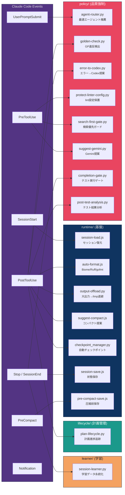
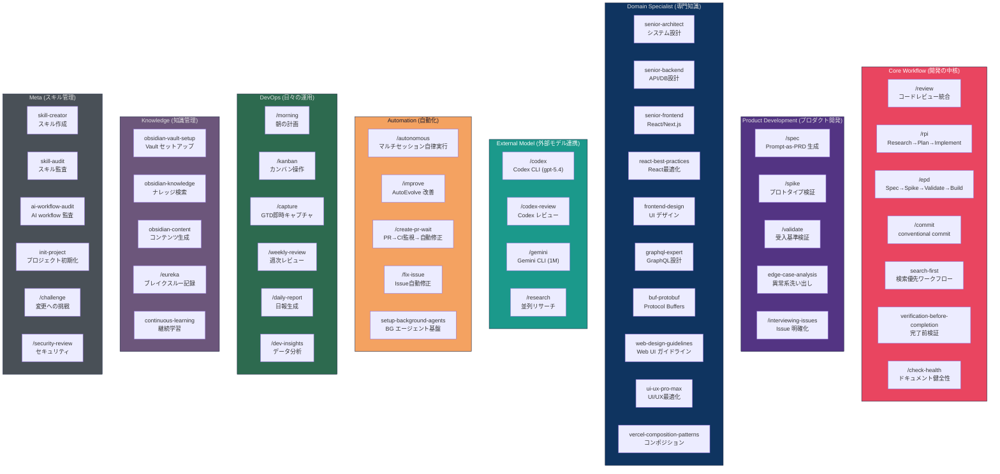
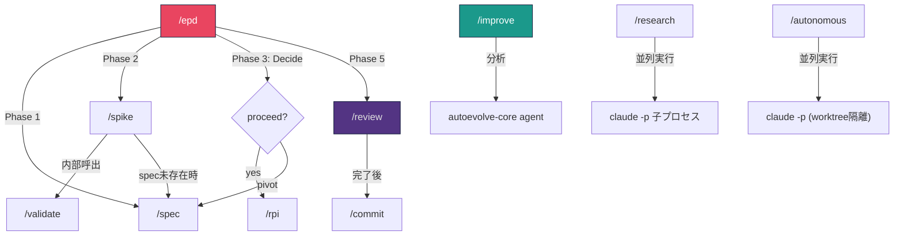
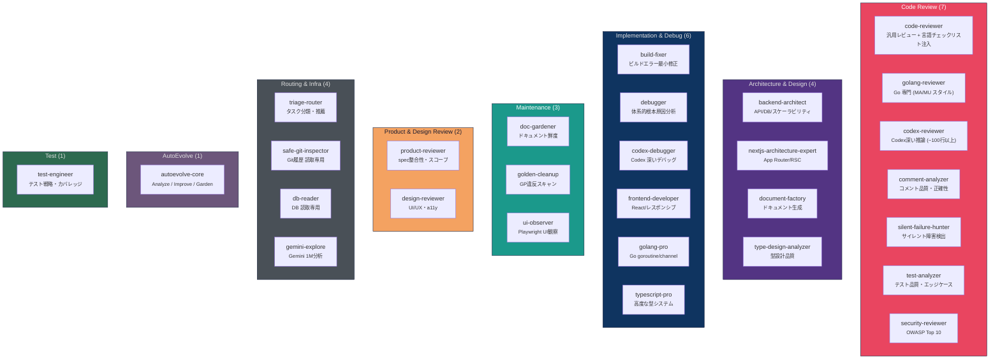
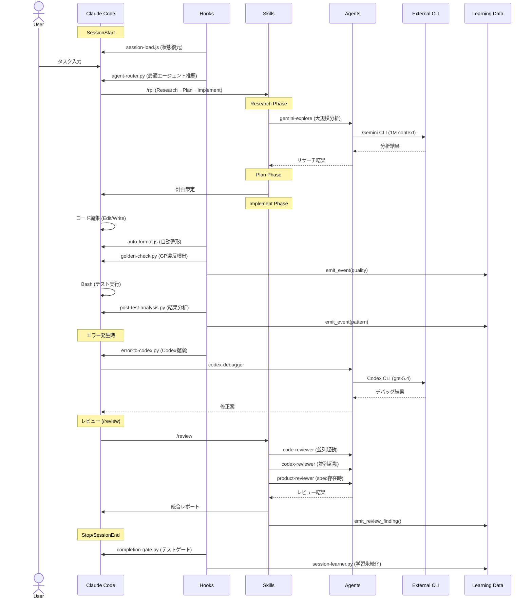
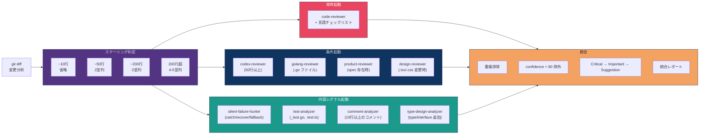
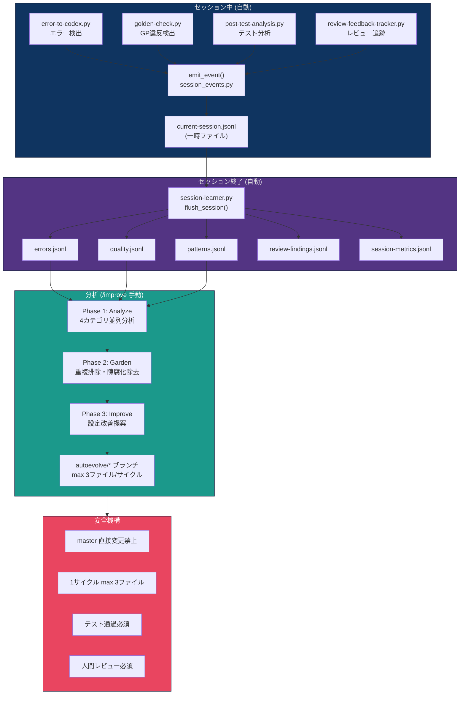
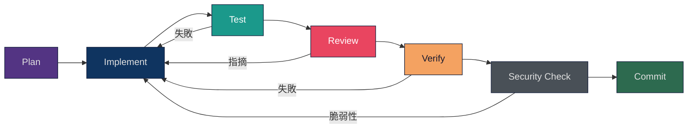
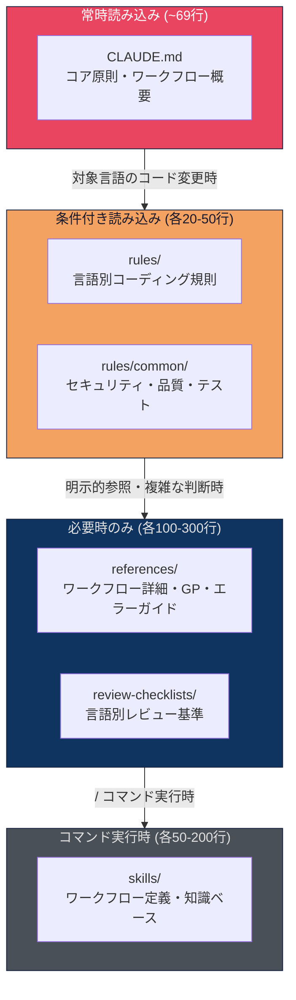

# Claude Code 設定

dotfiles リポジトリで管理する Claude Code のグローバル設定。
symlink 経由で `~/.claude/` に展開され、全プロジェクトで共有される。

## 運用入口

Claude Code の設定変更は、この README だけでなく以下も併せて参照する。

- repo 共通 contract: [../../AGENTS.md](../../AGENTS.md)
- plan contract: [../../PLANS.md](../../PLANS.md)
- Claude 固有指示: [CLAUDE.md](CLAUDE.md)
- 詳細 workflow: [references/workflow-guide.md](references/workflow-guide.md)
- skill inventory: [references/skill-inventory.md](references/skill-inventory.md)
- AI workflow 監査ガイド: [../../docs/guides/ai-workflow-audit.md](../../docs/guides/ai-workflow-audit.md)
- playbook: [../../docs/playbooks/claude-config-changes.md](../../docs/playbooks/claude-config-changes.md)

長時間タスクや複数ファイル変更では、`tmp/plans/` の一時 plan だけで終わらせず、
必要に応じて `docs/plans/` に永続 plan を残す。

---

## システム全体像

Claude Code は **3層マルチモデル連携** をオーケストレーションの中心に据え、
**Hooks** / **Skills** / **Agents** / **Plugins** が相互に連携する自律型開発ハーネスとして動作する。


### 3層モデル連携

| 層 | モデル | コンテキスト | 役割 | 委譲ルール |
|----|--------|-------------|------|-----------|
| **Orchestrator** | Claude Opus | 200K | 全体制御、コード生成、レビュー統合 | - |
| **Deep Reasoning** | Codex CLI (gpt-5.4) | 400K | 設計・推論・複雑なデバッグ | `rules/codex-delegation.md` |
| **Large Context** | Gemini CLI | 1M | 大規模分析・外部リサーチ・マルチモーダル | `rules/gemini-delegation.md` |

---

## ディレクトリ構造

```
.config/claude/
├── CLAUDE.md                     # グローバル指示書 (毎ターン読み込み)
├── README.md                     # ← このファイル
├── settings.json                 # メイン設定 (hooks, permissions, model)
├── settings.local.json           # ローカルオーバーライド
├── statusline.sh                 # ステータスライン表示
│
├── agents/                       # サブエージェント定義 (28個)
├── commands/                     # カスタムコマンド (19個)
├── skills/                       # 再利用可能なスキル (48+)
├── rules/                        # 言語・ドメイン別ルール (13個)
├── references/                   # 参照ドキュメント (24個)
│   └── review-checklists/        # 言語別レビュー基準
├── scripts/                      # Hook スクリプト (18個)
│   ├── runtime/                  # セッション管理・フォーマット
│   ├── policy/                   # ポリシー強制・エラー検出
│   ├── lifecycle/                # 計画追跡・ドキュメント管理
│   ├── learner/                  # 学習データ収集
│   └── lib/                      # 共有ユーティリティ
└── docs/
    └── research/                 # 外部CLI出力の永続保存
```

### Symlink マッピング

dotfiles → home への個別 symlink で接続:

```
~/.claude/agents              → dotfiles/.config/claude/agents
~/.claude/commands            → dotfiles/.config/claude/commands
~/.claude/scripts             → dotfiles/.config/claude/scripts
~/.claude/settings.json       → dotfiles/.config/claude/settings.json
~/.claude/settings.local.json → dotfiles/.config/claude/settings.local.json
~/.claude/statusline.sh       → dotfiles/.config/claude/statusline.sh
~/.claude/CLAUDE.md           → dotfiles/.config/claude/CLAUDE.md
```

> **注意**: `references/` は個別 symlink されていない。スクリプトからは `Path(__file__).resolve().parent.parent / "references"` で参照する。

### 変更時の最小検証

- `task validate-configs`
- `task validate-symlinks`

symlink 管理まで変えた場合は `task symlink` も実行する。

### MCP デフォルト

- global default は保守的にし、常時有効は `context7` を基本とする
- `playwright` や `deepwiki` は trusted repo や task 固有の必要があるときに有効化する
- global で全 project MCP を自動有効化しない

---

## Hooks システム（自動イベント駆動）

Hooks は Claude Code のライフサイクルイベントに対して**自動的に**スクリプトを実行する仕組み。
4つのカテゴリに分離されている。



### イベント → スクリプト対応表

| イベント | スクリプト | 役割 |
|---------|-----------|------|
| **SessionStart** | `session-load.js`, `checkpoint_recover.py` | セッション復元、前回チェックポイント回復 |
| **UserPromptSubmit** | `agent-router.py` | Codex/Gemini キーワード検出、最適エージェント推薦 |
| **PreToolUse** (Edit/Write) | `protect-linter-config.py`, `search-first-gate.py` | lint設定保護、検索優先ガード |
| **PreToolUse** (Bash) | `git add` 検証, `pre-commit-check.js` | `-A`/`--all` ブロック、コミットメッセージ検証 |
| **PreToolUse** (WebSearch) | `suggest-gemini.py` | 大規模リサーチ時に Gemini CLI を提案 |
| **PostToolUse** (Edit/Write) | `auto-format.js`, `golden-check.py`, `checkpoint_manager.py` | 自動整形、GP違反検出、チェックポイント |
| **PostToolUse** (Bash) | `output-offload.py`, `error-to-codex.py`, `post-test-analysis.py`, `plan-lifecycle.py` | 出力退避、エラー分析、テスト解析、計画追跡 |
| **PreCompact** | `pre-compact-save.js` | コンテキスト圧縮前にセッション状態保存 |
| **Stop/SessionEnd** | `completion-gate.py`, `session-save.js`, `session-learner.py` | テスト実行ゲート、状態保存、学習データ永続化 |

### 共有モジュール (scripts/lib/)

| モジュール | 役割 |
|-----------|------|
| `hook_utils.py` | JSON I/O、passthrough、コンテキスト注入 |
| `session_events.py` | イベントの emit / flush / 永続化の共通基盤 |
| `storage.py` | データディレクトリ解決 |
| `task_registry.py` | タスクレジストリ CRUD |
| `evaluator_metrics.py` | レビューアー精度メトリクス |
| `trace_sampler.py` | 大規模トレースのサンプリング |

### Plan / Checkpoint の役割分担

- plan: goal、scope、validation、decision を `PLANS.md` 契約で残す
- checkpoint: session 再開用の runtime state を保存する
- 長時間タスクでは両方を使う

---

## Skills カテゴリマップ (48+)

Skills は**知識ベース + ワークフロー定義**。コマンド(`/skill名`)で呼び出すか、エージェントが内部で参照する。

運用上は [references/skill-inventory.md](references/skill-inventory.md) の tier を優先する。



### スキル間の依存関係



---

## Agents カテゴリマップ (28)

Agents は**専門実行コンテキスト**。Skills が知識を提供し、Agents がそれを実行する。
`triage-router` が最適なエージェントを推薦する。



### 言語別レビューチェックリスト

`code-reviewer` のプロンプトに拡張子に応じて自動注入される:

| ファイル | 対象拡張子 | 観点 |
|---------|-----------|------|
| `references/review-checklists/typescript.md` | `.ts/.tsx/.js/.jsx` | 型安全性・React パターン・Node.js |
| `references/review-checklists/python.md` | `.py` | 型ヒント・Pythonic イディオム・例外設計 |
| `references/review-checklists/go.md` | `.go` | Effective Go・エラーハンドリング・並行処理 |
| `references/review-checklists/rust.md` | `.rs` | 所有権・ライフタイム・unsafe 最小化 |

---

## Skills ↔ Agents ↔ Hooks 連携フロー

Skills が「何をするか」を定義し、Agents が「どう実行するか」を担い、Hooks が「いつ発火するか」を制御する。



---

## EPD ワークフロー（フル開発サイクル）

大きな機能開発で使用する Spec → Spike → Validate → Build → Review の統合フロー。
Harrison Chase の "How Coding Agents Are Reshaping EPD" に基づく。


### ワークフロー使い分け

| シナリオ | 推奨コマンド |
|---------|-------------|
| 不確実なアイデア | `/epd` (フル6フェーズ) |
| 仕様が明確 | `/rpi` (Research→Plan→Implement) |
| 素早い検証 | `/spike` (worktree隔離プロトタイプ) |
| 仕様書のみ作成 | `/spec` |

---

## Review パイプライン

コードレビューは変更規模と内容シグナルに応じて**レビューアー数を自動スケール**する。



### レビュースケール表

| 変更行数 | レビューアー | 言語チェックリスト |
|---------|-------------|------------------|
| ~10行 | 省略 (Verify のみ) | - |
| ~50行 | code-reviewer + codex-reviewer | 拡張子で自動注入 |
| ~200行 | 上記 + golang-reviewer (Go時) | 同上 |
| 200行超 | 上記 + コンテンツベース専門家 | 同上 |

---

## AutoEvolve システム（自律改善ループ）

[karpathy/autoresearch](https://github.com/karpathy/autoresearch) に着想を得た自律改善システム。
セッションデータを自動収集・分析し、設定自体を改善する提案を生成する。



### 4層ループ

| 層 | トリガー | やること |
|----|---------|---------|
| **セッション** | Stop / SessionEnd hook | エラー・品質指摘を jsonl に自動記録 |
| **日次** | `/daily-report` | 「今日の学び」セクションで振り返り |
| **オンデマンド** | `/improve` コマンド | 分析 → 整理 → 設定改善提案 |
| **バックグラウンド** | `autoevolve-runner.sh` (cron) | 深夜に自律改善、朝レビュー |

### データフロー

```
生データ (jsonl)
  → 3回以上出現 → insights/ に整理 (autoevolve-core)
  → 確信度高 → MEMORY.md に追記 (autoevolve-core が提案)
  → 汎用性高 → skill / rule に昇格 (人間が承認)
```

### セキュリティ境界

| Git 管理 (公開OK) | ローカルのみ (非公開) |
|------------------|---------------------|
| エージェント定義、スキル、ルール | `learnings/*.jsonl` (生ログ) |
| hook ロジック、`improve-policy.md` | `metrics/` (セッション統計) |
| autoevolve の diff・履歴 | `logs/` (実行ログ) |
| `settings.json` (permissions) | `settings.local.json` (環境固有) |

---

## タスク規模別ワークフロー

| 規模 | 例 | 必須段階 |
|------|------|---------|
| **S** | typo修正、1行変更 | Implement → Verify |
| **M** | 関数追加、バグ修正 | Plan → Implement → Test → Verify |
| **L** | 新機能、リファクタリング | Plan → Implement → Test → Review → Verify → Security Check |



---

## Progressive Disclosure 設計

コンテキストウィンドウを効率的に使うための階層型設計:



---

## ルール (13個)

`rules/` 配下のルールは Claude Code が自動的に条件に応じて読み込む。

### 共通ルール

| ファイル | 適用場面 |
|---------|---------|
| `common/code-quality.md` | DRY, SOLID, 保守性 |
| `common/error-handling.md` | エラーハンドリングパターン |
| `common/security.md` | セキュリティベストプラクティス |
| `common/testing.md` | テスト戦略・カバレッジ |
| `common/overconfidence-prevention.md` | 不確実性の認知 |

### 言語別ルール

| ファイル | 対象 |
|---------|------|
| `typescript.md` | TypeScript 型安全性、React パターン |
| `react.md` | React コンポーネント設計、hooks |
| `go.md` | Go イディオム、エラーハンドリング、並行処理 |
| `rust.md` | Rust 所有権、ライフタイム、安全性 |
| `test.md` | テスト構造・命名規則 |
| `proto.md` | Protocol Buffers |

### モデル委譲ルール

| ファイル | 役割 |
|---------|------|
| `codex-delegation.md` | Codex CLI に委譲するタイミングと方法 |
| `gemini-delegation.md` | Gemini CLI に委譲するタイミングと方法 |
| `config.md` | 設定管理ルール |

---

## リファレンス (24個)

`references/` は詳細ドキュメント。必要時にのみ参照される (Progressive Disclosure)。

| ファイル | 内容 |
|---------|------|
| `workflow-guide.md` | 6段階ワークフロー詳細、エージェントルーティング、トークン予算 |
| `golden-principles.md` | GP-001〜008: 品質・設計原則の自動検出パターン |
| `improve-policy.md` | AutoEvolve の改善方針・制約・禁止事項 |
| `error-fix-guides.md` | エラーパターン→根本原因→修正のマッピング |
| `constraints-library.md` | C-001〜C-010 ソフト制約テンプレート |
| `subagent-delegation-guide.md` | 3委譲パターン (Sync, Async, Queue) |
| `subagent-framing.md` | サブエージェントへのフレーミング注入 |
| `agent-design-lessons.md` | エージェント設計パターンと教訓 |
| `failure-taxonomy.md` | FM-001〜FM-010 障害モード分類 |
| `research-checklist.md` | 構造化リサーチプロトコル |
| `scoring-rules.md` | レビュースコア計算ルール |
| `readability-principles.md` | コード可読性の原則 |
| `skill-inventory.md` | スキルカタログと使用ガイド |
| `task-registry-schema.md` | タスクレジストリ JSON スキーマ |
| `context-profiles.md` | コンテキスト切替パターン |
| `brownfield-analysis-template.md` | 大規模コードベース分析テンプレート |
| `e2e-tool-selection.md` | E2E テストツール選定マトリクス |
| `claudeignore-template.md` | .claudeignore テンプレート |
| `claude-code-threats.md` | セキュリティ脅威モデル |
| `mcp-server-template/` | MCP サーバー実装テンプレート |
| `review-checklists/typescript.md` | TypeScript レビュー基準 |
| `review-checklists/python.md` | Python レビュー基準 |
| `review-checklists/go.md` | Go レビュー基準 |
| `review-checklists/rust.md` | Rust レビュー基準 |

---

## Plugins (7個)

| プラグイン | 提供元 | 機能 |
|-----------|--------|------|
| `superpowers` | superpowers-marketplace | worktree, 並列エージェント, TDD 等のワークフロー |
| `frontend-design` | claude-code-plugins | 高品質 UI デザイン生成 |
| `pr-review-toolkit` | claude-code-plugins | PR レビュー用の専門エージェント群 |
| `code-simplifier` | claude-plugins-official | コードの簡素化・リファクタリング |
| `playground` | claude-plugins-official | インタラクティブ HTML プレイグラウンド |
| `gopls-lsp` | claude-plugins-official | Go LSP サポート |
| `datadog` | kw-marketplace | Datadog 連携 |

---

## MCP サーバー (3個)

| サーバー | 用途 |
|---------|------|
| `context7` | ライブラリの最新ドキュメント・コード例の取得 |
| `playwright` | Web アプリのブラウザ操作・スクリーンショット・テスト |
| `deepwiki` | DeepWiki からのナレッジ検索 |

---

## カスタムコマンド (19個)

`/command` で呼び出すスラッシュコマンド。

| コマンド | 説明 | タスク規模 |
|---------|------|-----------|
| `/commit` | conventional commit + 絵文字プレフィックスでコミット作成 | S |
| `/review` | 変更規模に応じてレビューアーを自動選択・並列起動 | M-L |
| `/pull-request` | PR 作成 (ブランチ push + タイトル/本文自動生成) | S |
| `/rpi` | Research → Plan → Implement の3フェーズ体系的実行 | L |
| `/epd` | Full EPD: Spec → Spike → Validate → Decide → Build | L |
| `/spec` | Prompt-as-PRD 仕様書生成 | M |
| `/spike` | Worktree 隔離プロトタイプ検証 | M |
| `/validate` | spec の受入基準に対する検証 | S |
| `/improve` | AutoEvolve 改善サイクルの手動実行 | L |
| `/research` | マルチエージェント並列リサーチ | M-L |
| `/autonomous` | マルチセッション自律実行 | L |
| `/fix-issue` | GitHub Issue を起点にした自動修正 | M-L |
| `/security-review` | OWASP Top 10 セキュリティレビュー | M |
| `/challenge` | 直前の変更を分析し、エレガント版再設計 | M |
| `/eureka` | 技術ブレイクスルーの構造化記録 | S |
| `/checkpoint` | セッション状態の手動チェックポイント | S |
| `/check-context` | コンテキストウィンドウ使用率確認 | S |
| `/memory-status` | メモリシステム状態サマリー | S |
| `/daily-report` | 全プロジェクト横断の日報生成 | M |

---

## 使い方

```bash
# 改善サイクルを手動で回す
/improve

# 改善の方向性を変える
vim ~/.claude/references/improve-policy.md

# バックグラウンドで実行
~/.claude/scripts/autoevolve-runner.sh

# cron で毎日自動実行
# crontab -e
# 0 3 * * * ~/.claude/scripts/autoevolve-runner.sh

# 提案されたブランチを確認
git branch --list "autoevolve/*"
git diff master..autoevolve/YYYY-MM-DD

# ログを確認
cat ~/.claude/agent-memory/logs/autoevolve.log
```
