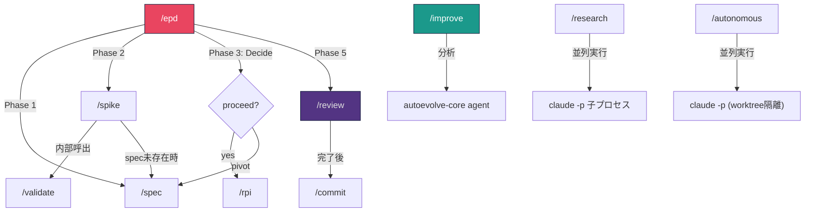
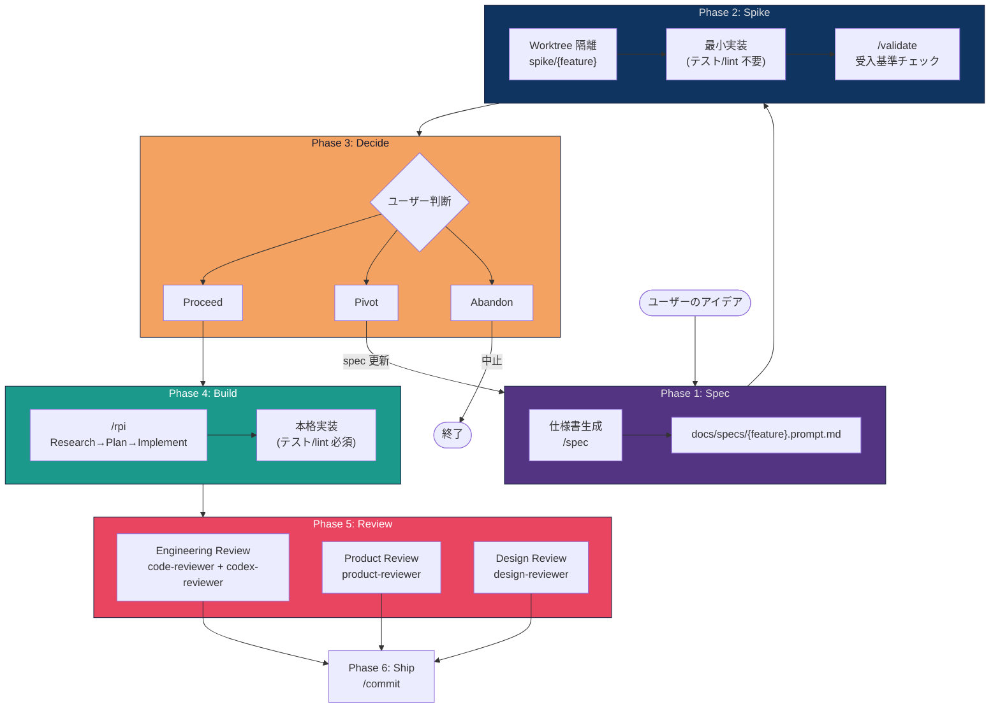

# Claude Code 設定

dotfiles リポジトリで管理する Claude Code のグローバル設定。
symlink 経由で `~/.claude/` に展開され、全プロジェクトで共有される。

## 運用入口

Claude Code の設定変更は、この README だけでなく以下も併せて参照する。

- repo 共通 contract: [../../AGENTS.md](../../AGENTS.md)
- plan contract: [../../PLANS.md](../../PLANS.md)
- Claude 固有指示: [CLAUDE.md](CLAUDE.md)
- 詳細 workflow: [references/workflow-guide.md](references/workflow-guide.md)
- skill inventory: [references/skill-inventory.md](references/skill-inventory.md)
- AI workflow 監査ガイド: [../../docs/guides/ai-workflow-audit.md](../../docs/guides/ai-workflow-audit.md)
- playbook: [../../docs/playbooks/claude-config-changes.md](../../docs/playbooks/claude-config-changes.md)

長時間タスクや複数ファイル変更では、`tmp/plans/` の一時 plan だけで終わらせず、
必要に応じて `docs/plans/` に永続 plan を残す。

---

## システム全体像

Claude Code は **3層マルチモデル連携** をオーケストレーションの中心に据え、
**Hooks** / **Skills** / **Agents** / **Plugins** が相互に連携する自律型開発ハーネスとして動作する。

```mermaid
graph TB
    User([ユーザー入力])

    subgraph orchestrator["Orchestrator Layer (Claude Opus)"]
        direction TB
        CC[Claude Code CLI]
        CLAUDE_MD["CLAUDE.md<br><small>コア原則 ~130行</small>"]
        SETTINGS["settings.json<br><small>hooks / permissions / model</small>"]
    end

    subgraph execution["Execution Layer"]
        direction TB
        subgraph hooks_box["Hooks (35 scripts)"]
            direction LR
            H_RT["Runtime<br><small>format, session, checkpoint</small>"]
            H_PO["Policy<br><small>golden-check, error-to-codex</small>"]
            H_LC["Lifecycle<br><small>plan-lifecycle, doc-garden</small>"]
            H_LR["Learner<br><small>session-learner</small>"]
        end

        subgraph skills_box["Skills (61)"]
            direction LR
            SK_CORE["Core Workflow<br><small>/review, /rpi, /epd</small>"]
            SK_DOMAIN["Domain<br><small>frontend, backend, architect</small>"]
            SK_EXT["External Model<br><small>/codex, /gemini, /research</small>"]
            SK_OPS["DevOps<br><small>/morning, /kanban, /capture</small>"]
        end

        subgraph agents_box["Agents (31)"]
            direction LR
            AG_REV["Review<br><small>code-reviewer, codex-reviewer</small>"]
            AG_IMPL["Implement<br><small>debugger, build-fixer</small>"]
            AG_MAINT["Maintenance<br><small>doc-gardener, golden-cleanup</small>"]
            AG_EVOLVE["AutoEvolve<br><small>autoevolve-core</small>"]
        end

        PLUGINS["Plugins (7)<br><small>superpowers, pr-review-toolkit, etc.</small>"]
    end

    subgraph external["External CLI Tools"]
        direction LR
        CODEX["Codex CLI<br><small>gpt-5.4 / 深い推論</small>"]
        GEMINI["Gemini CLI<br><small>1M tokens / 大規模分析</small>"]
    end

    subgraph data["Data & Learning Layer"]
        direction LR
        LEARNINGS["learnings/*.jsonl<br><small>errors, quality, patterns</small>"]
        METRICS["metrics/<br><small>session-metrics.jsonl</small>"]
        INSIGHTS["insights/<br><small>analysis reports</small>"]
    end

    User --> CC
    CC --> hooks_box
    CC --> skills_box
    CC --> agents_box
    CC --> PLUGINS
    SK_EXT --> CODEX
    SK_EXT --> GEMINI
    AG_EVOLVE --> LEARNINGS
    H_LR --> LEARNINGS
    H_PO --> LEARNINGS
    LEARNINGS --> INSIGHTS
    METRICS --> INSIGHTS

    style orchestrator fill:#1a1a2e,stroke:#533483,color:#e0e0e0
    style execution fill:#16213e,stroke:#533483,color:#e0e0e0
    style external fill:#0f3460,stroke:#533483,color:#e0e0e0
    style data fill:#1b1b2f,stroke:#e94560,color:#e0e0e0
```



### 3層モデル連携

| 層 | モデル | コンテキスト | 役割 | 委譲ルール |
|----|--------|-------------|------|-----------|
| **Orchestrator** | Claude Opus | 200K | 全体制御、コード生成、レビュー統合 | - |
| **Deep Reasoning** | Codex CLI (gpt-5.4) | 400K | 設計・推論・複雑なデバッグ | `rules/codex-delegation.md` |
| **Large Context** | Gemini CLI | 1M | 大規模分析・外部リサーチ・マルチモーダル | `rules/gemini-delegation.md` |

---

## ディレクトリ構造

```
.config/claude/
├── CLAUDE.md                     # グローバル指示書 (毎ターン読み込み)
├── README.md                     # ← このファイル
├── settings.json                 # メイン設定 (hooks, permissions, model)
├── settings.local.json           # ローカルオーバーライド
├── statusline.sh                 # ステータスライン表示
│
├── agents/                       # サブエージェント定義 (31個)
├── commands/                     # カスタムコマンド (27個)
├── skills/                       # 再利用可能なスキル (61個)
├── rules/                        # 言語・ドメイン別ルール (11個)
│   └── common/                   # 共通ルール (品質・セキュリティ・テスト)
├── references/                   # 参照ドキュメント (54個)
│   ├── review-checklists/        # 言語別レビュー基準
│   └── blueprints/               # ワークフローブループリント
├── scripts/                      # Hook スクリプト
│   ├── runtime/     (9個)        # セッション管理・フォーマット
│   ├── policy/      (20個)       # ポリシー強制・エラー検出
│   ├── lifecycle/   (4個)        # 計画追跡・ドキュメント管理
│   ├── learner/     (2個)        # 学習データ収集
│   └── lib/         (12個)       # 共有ユーティリティ
├── templates/                    # テンプレート
└── docs/
    └── research/                 # 外部CLI出力の永続保存
```

### Symlink マッピング

dotfiles → home への個別 symlink で接続:

```
~/.claude/agents              → dotfiles/.config/claude/agents
~/.claude/commands            → dotfiles/.config/claude/commands
~/.claude/scripts             → dotfiles/.config/claude/scripts
~/.claude/settings.json       → dotfiles/.config/claude/settings.json
~/.claude/settings.local.json → dotfiles/.config/claude/settings.local.json
~/.claude/statusline.sh       → dotfiles/.config/claude/statusline.sh
~/.claude/CLAUDE.md           → dotfiles/.config/claude/CLAUDE.md
```

> **注意**: `references/` は個別 symlink されていない。スクリプトからは `Path(__file__).resolve().parent.parent / "references"` で参照する。

### 変更時の最小検証

- `task validate-configs`
- `task validate-symlinks`

symlink 管理まで変えた場合は `task symlink` も実行する。

### MCP デフォルト

- global default は保守的にし、常時有効は `context7` を基本とする
- `playwright` や `deepwiki` は trusted repo や task 固有の必要があるときに有効化する
- global で全 project MCP を自動有効化しない

---

## Hooks システム

Hooks は Claude Code のライフサイクルイベントに対して自動的にスクリプトを実行する仕組み。
4 カテゴリ・35 スクリプトで構成。

### イベント → スクリプト対応表

| イベント | スクリプト | 役割 |
|---------|-----------|------|
| **SessionStart** | `session-load.js`, `checkpoint_recover.py` | セッション復元、前回チェックポイント回復 |
| **UserPromptSubmit** | `agent-router.py` | Codex/Gemini キーワード検出、最適エージェント推薦 |
| **PreToolUse** (Edit/Write) | `protect-linter-config.py`, `search-first-gate.py`, `tool-scope-enforcer.py` | lint設定保護、検索優先ガード、ツールスコープ制限 |
| **PreToolUse** (Bash) | `pre-commit-check.js`, `docker-safety.py` | コミット検証、Docker 安全性チェック |
| **PreToolUse** (WebSearch) | `suggest-gemini.py` | 大規模リサーチ時に Gemini CLI を提案 |
| **PostToolUse** (Edit/Write) | `auto-format.js`, `golden-check.py`, `checkpoint_manager.py`, `file-proliferation-guard.py` | 自動整形、GP違反検出、チェックポイント、ファイル増殖防止 |
| **PostToolUse** (Bash) | `output-offload.py`, `error-to-codex.py`, `post-test-analysis.py`, `plan-lifecycle.py`, `stagnation-detector.py` | 出力退避、エラー分析、テスト解析、計画追跡、停滞検知 |
| **PreCompact** | `pre-compact-save.js` | コンテキスト圧縮前にセッション状態保存 |
| **Stop/SessionEnd** | `completion-gate.py`, `session-save.js`, `session-learner.py`, `skill-usage-tracker.py` | テスト実行ゲート、状態保存、学習データ永続化、スキル利用追跡 |

### policy/ スクリプト一覧 (20個)

| スクリプト | 役割 |
|-----------|------|
| `agent-router.py` | 最適エージェント推薦 |
| `agentshield-filter.py` | エージェント入力フィルタリング |
| `completion-gate.py` | テスト実行ゲート |
| `docker-safety.py` | Docker コマンド安全性チェック |
| `error-to-codex.py` | エラー→Codex 提案 |
| `file-pattern-router.py` | ファイルパターンルーティング |
| `file-proliferation-guard.py` | ファイル増殖防止 |
| `gaming-detector.py` | specification gaming 検出 |
| `golden-check.py` | Golden Principles 違反検出 |
| `mcp-audit.py` | MCP サーバー監査 |
| `post-test-analysis.py` | テスト結果分析 |
| `pre-commit-check.js` | コミットメッセージ検証 |
| `protect-linter-config.py` | lint 設定保護 |
| `review-feedback-tracker.py` | レビューフィードバック追跡 |
| `search-first-gate.py` | 検索優先ガード |
| `skill-security-scan.py` | スキルセキュリティスキャン |
| `skill-tracker.py` | スキル利用追跡 |
| `stagnation-detector.py` | 停滞検知 |
| `suggest-gemini.py` | Gemini CLI 提案 |
| `tool-scope-enforcer.py` | ツールスコープ制限 |

### runtime/ スクリプト一覧 (9個)

| スクリプト | 役割 |
|-----------|------|
| `auto-format.js` | Biome/Ruff/gofmt 自動整形 |
| `checkpoint_manager.py` | 自動チェックポイント |
| `checkpoint_recover.py` | チェックポイント回復 |
| `output-offload.py` | 大出力→/tmp 退避 |
| `pre-compact-save.js` | 圧縮前保存 |
| `session-load.js` | セッション状態復元 |
| `session-save.js` | セッション状態保存 |
| `subagent-monitor.py` | サブエージェント監視 |
| `suggest-compact.js` | コンパクト提案 |

### lifecycle/ スクリプト一覧 (4個)

| スクリプト | 役割 |
|-----------|------|
| `context-drift-check.py` | コンテキストドリフト検出 |
| `doc-garden-check.py` | ドキュメント鮮度チェック |
| `memory-archive.py` | メモリアーカイブ |
| `plan-lifecycle.py` | 計画進捗追跡 |

### learner/ スクリプト一覧 (2個)

| スクリプト | 役割 |
|-----------|------|
| `session-learner.py` | 学習データ永続化 |
| `skill-usage-tracker.py` | スキル使用頻度追跡 |

### 共有モジュール (scripts/lib/)

| モジュール | 役割 |
|-----------|------|
| `hook_utils.py` | JSON I/O、passthrough、コンテキスト注入 |
| `session_events.py` | イベントの emit / flush / 永続化の共通基盤 |
| `storage.py` | データディレクトリ解決 |
| `task_registry.py` | タスクレジストリ CRUD |
| `evaluator_metrics.py` | レビューアー精度メトリクス |
| `trace_sampler.py` | 大規模トレースのサンプリング |
| `rl_advantage.py` | RL アドバンテージ計算 |
| `skill_amender.py` | スキル修正ユーティリティ |
| `test_selector.py` | テスト選択 |
| `tip_generalizer.py` | ヒント汎化 |

---

## Skills カテゴリマップ (61個)

Skills は**知識ベース + ワークフロー定義**。コマンド(`/skill名`)で呼び出すか、エージェントが内部で参照する。
運用上は [references/skill-inventory.md](references/skill-inventory.md) の tier を優先する。

### Core Workflow (開発の中核)

| スキル | 説明 |
|--------|------|
| `review` | コードレビュー統合 (レビューアー自動選択・並列起動) |
| `epd` | Spec → Spike → Validate → Build → Review |
| `search-first` | 検索優先ワークフロー |
| `verification-before-completion` | 完了前検証 |
| `check-health` | ドキュメント健全性チェック |
| `continuous-learning` | 自動パターン検出・記録 |

### Product Development

| スキル | 説明 |
|--------|------|
| `spec` | Prompt-as-PRD 仕様書生成 |
| `spike` | Worktree 隔離プロトタイプ検証 |
| `validate` | 受入基準検証 |
| `edge-case-analysis` | 異常系・境界値洗い出し |
| `interviewing-issues` | Issue 明確化インタビュー |
| `audit` | コードベース品質監査 |
| `autocover` | テスト自動生成パイプライン |

### Domain Specialist (専門知識)

| スキル | 説明 |
|--------|------|
| `senior-architect` | システムアーキテクチャ設計 |
| `senior-backend` | API/DB 設計 |
| `senior-frontend` | React/Next.js アーキテクチャ |
| `react-best-practices` | React パフォーマンス最適化 (40+ ルール) |
| `react-expert` | React API リサーチ |
| `frontend-design` | 高品質 UI デザイン生成 |
| `graphql-expert` | GraphQL 設計・実装 |
| `buf-protobuf` | Protocol Buffers / Buf エコシステム |
| `ui-ux-pro-max` | UI/UX 最適化 (10 スタック対応) |
| `web-design-guidelines` | Web Interface Guidelines 準拠レビュー |
| `vercel-composition-patterns` | React コンポジションパターン |

### External Model (外部モデル連携)

| スキル | 説明 |
|--------|------|
| `codex` | Codex CLI (gpt-5.4) 実行 |
| `codex-review` | Codex AI コードレビュー・CHANGELOG 生成 |
| `gemini` | Gemini CLI (1M ctx) 大規模分析 |
| `research` | マルチエージェント並列リサーチ |
| `debate` | 複数 AI モデルによるセカンドオピニオン |

### Automation

| スキル | 説明 |
|--------|------|
| `autonomous` | マルチセッション自律実行 |
| `improve` | AutoEvolve 改善サイクル |
| `create-pr-wait` | PR → CI 監視 → 自動修正 |
| `github-pr` | PR セルフレビュー・マージ判断 |
| `setup-background-agents` | バックグラウンドエージェント基盤セットアップ |
| `absorb` | 外部記事・論文の知見統合 |

### DevOps (日々の運用)

| スキル | 説明 |
|--------|------|
| `morning` | 朝の開発計画生成 |
| `kanban` | カンバンボード操作 |
| `capture` | GTD 即時キャプチャ |
| `weekly-review` | GTD 式週次レビュー |
| `daily-report` | 全プロジェクト横断日報 |
| `dev-insights` | 開発データ分析 |
| `timekeeper` | 朝の計画・夕方の振り返り |

### Knowledge (知識管理)

| スキル | 説明 |
|--------|------|
| `obsidian-vault-setup` | Vault セットアップ |
| `obsidian-knowledge` | ナレッジ検索・整理 |
| `obsidian-content` | コンテンツ生成 |
| `digest` | NotebookLM → Literature Note 変換 |
| `eureka` | 技術ブレイクスルー記録 |

### Meta (スキル・プロジェクト管理)

| スキル | 説明 |
|--------|------|
| `skill-creator` | スキル作成・編集・ベンチマーク |
| `skill-audit` | スキル品質監査・A/B テスト |
| `ai-workflow-audit` | AI ワークフロー監査 |
| `init-project` | プロジェクト初期化 |
| `prompt-review` | プロンプトレビュー |

### Safety & Debug

| スキル | 説明 |
|--------|------|
| `careful` | 本番環境操作ガード |
| `freeze` | 編集禁止モード (デバッグ用) |
| `hook-debugger` | Hook 診断 Runbook |
| `webapp-testing` | agent-browser による Web アプリテスト |
| `upload-image-to-pr` | 画像を PR に埋め込み |
| `nano-banana` | AI 画像生成 (Gemini 3.1 Flash) |
| `meeting-minutes` | 議事録生成 |
| `dev-ops-setup` | DevOps セットアップ |
| `developer-onboarding` | 開発者オンボーディング |

### スキル間の依存関係



---

## Agents カテゴリマップ (31個)

Agents は**専門実行コンテキスト**。Skills が知識を提供し、Agents がそれを実行する。
`triage-router` が最適なエージェントを推薦する。

### Code Review (8)

| エージェント | 役割 |
|-------------|------|
| `code-reviewer` | 汎用レビュー + 言語チェックリスト注入 |
| `golang-reviewer` | Go 専門 (MA/MU スタイル) |
| `codex-reviewer` | Codex 深い推論 (~100行以上) |
| `cross-file-reviewer` | 変更の他ファイルへの影響検出 |
| `comment-analyzer` | コメント品質・正確性 |
| `silent-failure-hunter` | サイレント障害検出 |
| `test-analyzer` | テスト品質・エッジケース |
| `security-reviewer` | OWASP Top 10・信頼境界 |

### Architecture & Design (4)

| エージェント | 役割 |
|-------------|------|
| `backend-architect` | API/DB/スケーラビリティ |
| `nextjs-architecture-expert` | App Router/RSC |
| `document-factory` | ドキュメント自動生成 |
| `type-design-analyzer` | 型設計品質 |

### Implementation & Debug (7)

| エージェント | 役割 |
|-------------|------|
| `build-fixer` | ビルドエラー最小修正 |
| `debugger` | 体系的根本原因分析 |
| `codex-debugger` | Codex 深いデバッグ |
| `codex-risk-reviewer` | 実装前リスク分析 |
| `frontend-developer` | React/レスポンシブ |
| `golang-pro` | Go goroutine/channel |
| `typescript-pro` | 高度な型システム |

### Maintenance (3)

| エージェント | 役割 |
|-------------|------|
| `doc-gardener` | ドキュメント鮮度 |
| `golden-cleanup` | GP 違反スキャン |
| `ui-observer` | Playwright UI 観察 |

### Product & Design Review (2)

| エージェント | 役割 |
|-------------|------|
| `product-reviewer` | spec 整合性・スコープ |
| `design-reviewer` | UI/UX・a11y |

### Test (2)

| エージェント | 役割 |
|-------------|------|
| `test-engineer` | テスト戦略・カバレッジ |
| `edge-case-hunter` | 境界値・異常系検出 |

### Routing & Infra (4)

| エージェント | 役割 |
|-------------|------|
| `triage-router` | タスク分類・推薦 |
| `safe-git-inspector` | Git 履歴 読取専用 |
| `db-reader` | DB 読取専用 |
| `gemini-explore` | Gemini 1M 分析 |

### AutoEvolve (1)

| エージェント | 役割 |
|-------------|------|
| `autoevolve-core` | Analyze / Improve / Garden |

### 言語別レビューチェックリスト

`code-reviewer` のプロンプトに拡張子に応じて自動注入される:

| ファイル | 対象拡張子 | 観点 |
|---------|-----------|------|
| `references/review-checklists/typescript.md` | `.ts/.tsx/.js/.jsx` | 型安全性・React パターン・Node.js |
| `references/review-checklists/python.md` | `.py` | 型ヒント・Pythonic イディオム・例外設計 |
| `references/review-checklists/go.md` | `.go` | Effective Go・エラーハンドリング・並行処理 |
| `references/review-checklists/rust.md` | `.rs` | 所有権・ライフタイム・unsafe 最小化 |

---

## EPD ワークフロー

大きな機能開発で使用する Spec → Spike → Validate → Build → Review の統合フロー。
Harrison Chase の "How Coding Agents Are Reshaping EPD" に基づく。



### ワークフロー使い分け

| シナリオ | 推奨コマンド |
|---------|-------------|
| 不確実なアイデア | `/epd` (フル6フェーズ) |
| 仕様が明確 | `/rpi` (Research→Plan→Implement) |
| 素早い検証 | `/spike` (worktree隔離プロトタイプ) |
| 仕様書のみ作成 | `/spec` |

---

## Review パイプライン

コードレビューは変更規模と内容シグナルに応じて**レビューアー数を自動スケール**する。

### レビュースケール表

| 変更行数 | レビューアー | 言語チェックリスト |
|---------|-------------|------------------|
| ~10行 | 省略 (Verify のみ) | - |
| ~50行 | code-reviewer + codex-reviewer | 拡張子で自動注入 |
| ~200行 | 上記 + golang-reviewer (Go時) | 同上 |
| 200行超 | 上記 + コンテンツベース専門家 | 同上 |

---

## AutoEvolve システム

[karpathy/autoresearch](https://github.com/karpathy/autoresearch) に着想を得た自律改善システム。
セッションデータを自動収集・分析し、設定自体を改善する提案を生成する。

### 4層ループ

| 層 | トリガー | やること |
|----|---------|---------|
| **セッション** | Stop / SessionEnd hook | エラー・品質指摘を jsonl に自動記録 |
| **日次** | `/daily-report` | 「今日の学び」セクションで振り返り |
| **オンデマンド** | `/improve` コマンド | 分析 → 整理 → 設定改善提案 |
| **バックグラウンド** | `autoevolve-runner.sh` (cron) | 深夜に自律改善、朝レビュー |

### データフロー

```
生データ (jsonl)
  → 3回以上出現 → insights/ に整理 (autoevolve-core)
  → 確信度高 → MEMORY.md に追記 (autoevolve-core が提案)
  → 汎用性高 → skill / rule に昇格 (人間が承認)
```

### 安全機構

- master 直接変更禁止
- 1サイクル max 3ファイル
- テスト通過必須
- 人間レビュー必須

### セキュリティ境界

| Git 管理 (公開OK) | ローカルのみ (非公開) |
|------------------|---------------------|
| エージェント定義、スキル、ルール | `learnings/*.jsonl` (生ログ) |
| hook ロジック、`improve-policy.md` | `metrics/` (セッション統計) |
| autoevolve の diff・履歴 | `logs/` (実行ログ) |
| `settings.json` (permissions) | `settings.local.json` (環境固有) |

---

## タスク規模別ワークフロー

| 規模 | 例 | 必須段階 |
|------|------|---------|
| **S** | typo修正、1行変更 | Implement → Verify |
| **M** | 関数追加、バグ修正 | Plan → Implement → Test → Verify |
| **L** | 新機能、リファクタリング | Plan → Implement → Test → Review → Verify → Security Check |

---

## Progressive Disclosure 設計

コンテキストウィンドウを効率的に使うための階層型設計:

| 層 | 読み込みタイミング | 例 |
|----|-------------------|-----|
| **常時** (~130行) | 毎ターン | `CLAUDE.md` コア原則・ワークフロー概要 |
| **条件付き** (各20-50行) | 対象言語のコード変更時 | `rules/` 言語別コーディング規則 |
| **必要時のみ** (各100-300行) | 明示的参照・複雑な判断時 | `references/` ワークフロー詳細・GP・エラーガイド |
| **コマンド実行時** (各50-200行) | `/` コマンド実行時 | `skills/` ワークフロー定義・知識ベース |

---

## ルール (11個)

`rules/` 配下のルールは Claude Code が自動的に条件に応じて読み込む。

### 言語別ルール

| ファイル | 対象 |
|---------|------|
| `typescript.md` | TypeScript 型安全性、React パターン |
| `react.md` | React コンポーネント設計、hooks |
| `python.md` | Python イディオム、型ヒント |
| `go.md` | Go イディオム、エラーハンドリング、並行処理 |
| `rust.md` | Rust 所有権、ライフタイム、安全性 |
| `test.md` | テスト構造・命名規則 |
| `proto.md` | Protocol Buffers |
| `config.md` | 設定管理ルール |

### モデル委譲ルール

| ファイル | 役割 |
|---------|------|
| `codex-delegation.md` | Codex CLI に委譲するタイミングと方法 |
| `gemini-delegation.md` | Gemini CLI に委譲するタイミングと方法 |

### 共通ルール (`common/`)

品質・セキュリティ・テスト・エラーハンドリング等の共通規則。

---

## カスタムコマンド (27個)

`/command` で呼び出すスラッシュコマンド。

| コマンド | 説明 | 規模 |
|---------|------|------|
| `/commit` | conventional commit + 絵文字プレフィックスでコミット | S |
| `/review` | 変更規模に応じてレビューアーを自動選択・並列起動 | M-L |
| `/pull-request` | PR 作成 (ブランチ push + タイトル/本文自動生成) | S |
| `/rpi` | Research → Plan → Implement の3フェーズ | L |
| `/epd` | Full EPD: Spec → Spike → Validate → Decide → Build | L |
| `/spec` | Prompt-as-PRD 仕様書生成 | M |
| `/spike` | Worktree 隔離プロトタイプ検証 | M |
| `/validate` | spec の受入基準に対する検証 | S |
| `/improve` | AutoEvolve 改善サイクルの手動実行 | L |
| `/research` | マルチエージェント並列リサーチ | M-L |
| `/autonomous` | マルチセッション自律実行 | L |
| `/fix-issue` | GitHub Issue を起点にした自動修正 | M-L |
| `/security-review` | OWASP Top 10 セキュリティレビュー | M |
| `/security-scan` | AgentShield セキュリティ監査 | M |
| `/challenge` | 直前の変更を分析し、エレガント版再設計 | M |
| `/eureka` | 技術ブレイクスルーの構造化記録 | S |
| `/checkpoint` | セッション状態の手動チェックポイント | S |
| `/check-context` | コンテキストウィンドウ使用率確認 | S |
| `/memory-status` | メモリシステム状態サマリー | S |
| `/daily-report` | 全プロジェクト横断の日報生成 | M |
| `/absorb` | 外部記事・論文の知見統合 | M-L |
| `/interview` | spec のための深いインタビュー | M |
| `/recall` | コミット履歴からコンテキスト復元 | S |
| `/onboarding` | 開発者プロファイル構築 | M |
| `/profile-drip` | プロファイル 1日1問漸進構築 | S |
| `/persona` | 口調切り替え (ギャル/妹/メスガキ/お姉さん) | S |
| `/timekeeper` | 朝の計画・夕方の振り返り | M |
| `/init-project` | プロジェクト初期化 | L |

---

## Plugins (7個)

| プラグイン | 提供元 | 機能 |
|-----------|--------|------|
| `superpowers` | superpowers-marketplace | worktree, 並列エージェント, TDD 等のワークフロー |
| `frontend-design` | claude-code-plugins | 高品質 UI デザイン生成 |
| `pr-review-toolkit` | claude-code-plugins | PR レビュー用の専門エージェント群 |
| `code-simplifier` | claude-plugins-official | コードの簡素化・リファクタリング |
| `playground` | claude-plugins-official | インタラクティブ HTML プレイグラウンド |
| `gopls-lsp` | claude-plugins-official | Go LSP サポート |
| `datadog` | kw-marketplace | Datadog 連携 |

---

## MCP サーバー

| サーバー | 用途 |
|---------|------|
| `context7` | ライブラリの最新ドキュメント・コード例の取得 |
| `brave-search` | Brave Web/Local 検索 |
| `playwright` | Web アプリのブラウザ操作・スクリーンショット・テスト |

---

## 使い方

```bash
# 改善サイクルを手動で回す
/improve

# 改善の方向性を変える
vim ~/.claude/references/improve-policy.md

# バックグラウンドで実行
~/.claude/scripts/autoevolve-runner.sh

# cron で毎日自動実行
# crontab -e
# 0 3 * * * ~/.claude/scripts/autoevolve-runner.sh

# 提案されたブランチを確認
git branch --list "autoevolve/*"
git diff master..autoevolve/YYYY-MM-DD

# ログを確認
cat ~/.claude/agent-memory/logs/autoevolve.log
```
