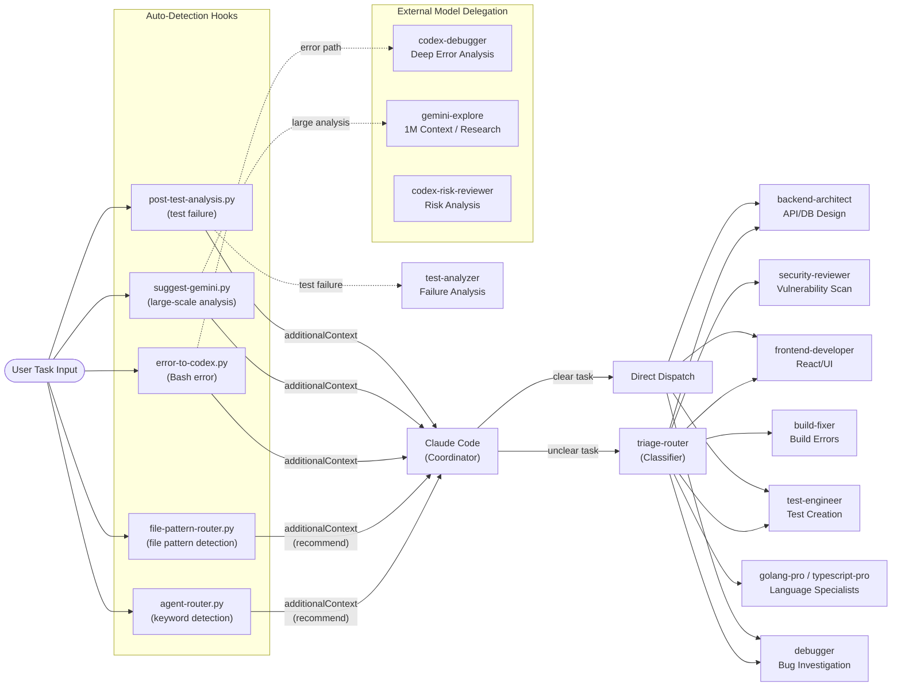

# Agent Routing: Triage-Router Decision Flow

ユーザータスク入力から専門エージェントへのルーティングフロー。hooks による自動推奨と triage-router による分類を示す。

**データソース**: `references/agent-orchestration-map.md`、`references/workflow-guide.md` (L246-286)

## 補足

- **Implicit Coordinator Pattern**: 明示的な orchestrator は存在しない。Claude Code 本体が全ての意思決定権を持ち、hooks は「推奨」のみ行う（強制しない）
- **Hook の役割**: `agent-router.py` はタスクキーワードから、`file-pattern-router.py` はファイル拡張子パターンから最適なエージェントを推奨する。いずれも `additionalContext` でメインコンテキストに情報を追加するだけ
- **triage-router**: hooks で判断がつかない不明瞭なタスクに対して、種別を判定して最適エージェントにルーティングする Classifier エージェント
- **外部モデル委譲**: Codex（深い推論、リスク分析）と Gemini（1M コンテキスト分析、リサーチ）は、Claude Code 単体で処理が難しいタスクに対して起動される
- **全31エージェント**のうち、代表的なものだけを図示。完全なルーティングテーブルは `agent-orchestration-map.md` と `workflow-guide.md` を参照
