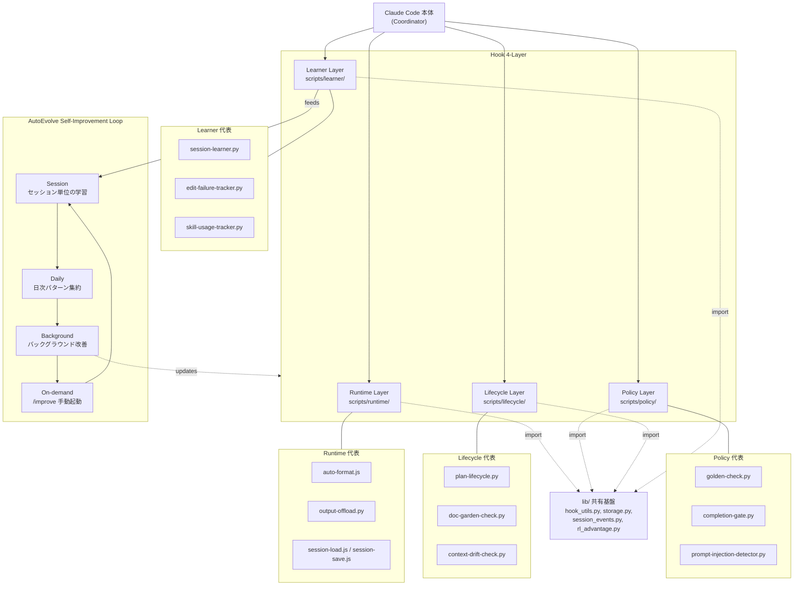

# Architecture Overview: Harness 4-Layer + AutoEvolve

Claude Code ハーネスの4層 hook アーキテクチャと AutoEvolve 自己改善ループの全体構造。

**データソース**: `.config/claude/scripts/` 各ディレクトリ、`CLAUDE.md`、`references/workflow-guide.md`

## 補足

- **Runtime**: セッション開始/終了、フォーマット、出力管理など実行時の自動処理を担当
- **Policy**: コード品質ゲート、セキュリティ検査、完了条件の強制など品質ポリシーを担当
- **Lifecycle**: Plan の状態管理、ドキュメント鮮度チェック、コンテキストドリフト検出を担当
- **Learner**: セッションからの学習、失敗パターン追跡、スキル使用状況の記録を担当
- **lib/**: 全レイヤーが共有するユーティリティ。`hook_utils.py` のパス解決、`storage.py` の永続化など
- **AutoEvolve**: Learner 層が収集したデータを元に、Session -> Daily -> Background -> On-demand の4段階で自己改善を回す。1サイクルで最大3ファイルの変更に制限される安全機構あり
