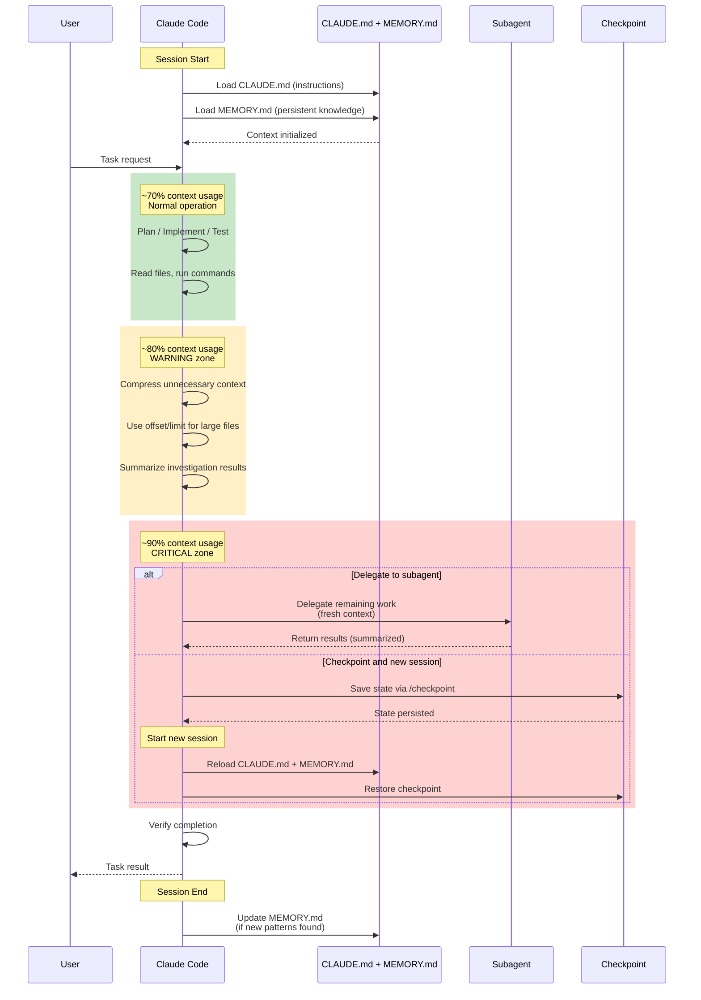

# Context Lifecycle: Token Budget Management

セッション開始からコンテキスト圧縮・委譲・完了までのライフサイクルを示す。

**データソース**: `references/workflow-guide.md` (L397-443)

## 補足

- **Lost-in-the-middle 対策**: 重要情報はコンテキストの先頭と末尾に配置する。中間部に埋もれた情報は見落とされやすい
- **Context Placement Strategy**: サブエージェントへの指示は「目的 -> 制約 -> 入力データ -> 出力形式」の順で構造化する
- **セッション分離原則**: 1セッション1タスクが原則。無関係なタスクを混ぜると autocompact 後に前タスクの仮定が残留し、品質が低下する
- **Persistent Facts Block**: 圧縮されても残すべき事実は MEMORY.md に永続化する。Session -> MEMORY.md -> Skill の3層メモリ構造で知見を段階的に昇格させる
- **トークン節約テクニック**: 大きなファイルは必要部分だけ Read（offset/limit 指定）、長い出力は head/tail でフィルタ、独立タスクはサブエージェントに並列委譲
