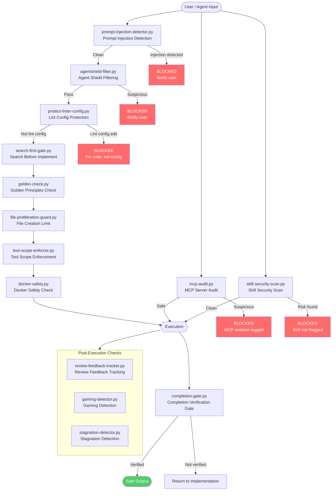

# Security Layers: Hook Chain + MCP Audit

入力から実行までのセキュリティ hook チェーンと MCP 監査パスを示す。

**データソース**: `scripts/policy/` ディレクトリ一覧、`references/workflow-guide.md`

## 補足

- **多層防御**: 単一の hook に依存せず、入力段階（injection detection）-> 実行段階（scope enforcement）-> 完了段階（completion gate）の3段階でセキュリティを担保
- **Policy hooks の全体像**: `scripts/policy/` には21個の hook が存在。図では主要なセキュリティ関連 hook を抜粋
- **MCP 監査**: `mcp-audit.py` はメインチェーンとは並列に動作し、MCP サーバーとの通信を監査する。OWASP MCP Top 10 に基づく検査
- **protect-linter-config**: `.eslintrc*`, `biome.json`, `.prettierrc*` 等の lint 設定ファイルへの変更をブロックする。設定ではなくコードを修正させる方針
- **completion-gate**: タスク完了宣言時に、実際にビルド・テスト・lint が通っているか検証を強制するゲート。仮定に基づく「問題ありません」を防止
- **gaming-detector**: AutoEvolve の自己改善ループにおいて、メトリクスを不正に操作するパターンを検出する
- **Post-Execution**: 実行後もフィードバック追跡、ゲーミング検出、膠着検出が継続的に動作する
