# Workflow Decision Tree: S/M/L Task Size Routing

タスク規模の多因子判定と、規模ごとの必須ワークフロー段階の分岐を示す。

**データソース**: `references/workflow-guide.md` (L186-238)

```mermaid
flowchart TD
    START(["New Task"])

    START --> ASSESS["Multi-Factor Assessment"]

    ASSESS --> F1{"Change Size?"}
    F1 -->|"1-10 lines"| S1["S candidate"]
    F1 -->|"11-200 lines"| M1["M candidate"]
    F1 -->|"200+ lines"| L1["L candidate"]

    ASSESS --> F2{"Risk Level?"}
    F2 -->|"Low<br/>(type-safe, tested)"| S2["S candidate"]
    F2 -->|"Medium<br/>(new logic)"| M2["M candidate"]
    F2 -->|"High<br/>(architecture impact)"| L2["L candidate"]

    ASSESS --> F3{"Scope?"}
    F3 -->|"Single file"| S3["S candidate"]
    F3 -->|"Single module"| M3["M candidate"]
    F3 -->|"Multi-module / API"| L3["L candidate"]

    ASSESS --> DECIDE{"Highest factor<br/>determines size"}

    DECIDE -->|S| WF_S
    DECIDE -->|M| WF_M
    DECIDE -->|L| WF_L

    subgraph WF_S ["S: Minimal Workflow"]
        SI["Implement"] --> SV["Verify"]
    end

    subgraph WF_M ["M: Standard Workflow"]
        MSR["Spec Review"] --> MP["Plan"]
        MP --> MRA["Risk Analysis<br/>(edge-case + codex-risk)"]
        MRA -->|CRITICAL| MP
        MRA -->|OK| MI["Implement"]
        MI --> MT["Test"]
        MT -->|Fail| MI
        MT -->|Pass| MV["Verify"]
    end

    subgraph WF_L ["L: Comprehensive Workflow"]
        LSR["Spec Review"] --> LCK["Checkpoint Commit"]
        LCK --> LP["Plan<br/>+ Plan Review Loop"]
        LP --> LRA["Risk Analysis<br/>+ Plan Second Opinion"]
        LRA -->|CRITICAL| LP
        LRA -->|OK| LI["Implement"]
        LI --> LT["Test"]
        LT -->|Fail| LI
        LT -->|Pass| LRV["Review<br/>(multi-agent parallel)"]
        LRV -->|Issues| LI
        LRV -->|Approved| LVF["Verify"]
        LVF -->|Fail| LI
        LVF -->|Pass| LSC["Security Check"]
        LSC -->|Critical/High| LI
        LSC -->|Pass| DONE(["Commit"])
    end
```

## 補足

- **最も高い因子に合わせる**: 変更が10行でも、リスクが高ければ L として扱う。行数だけで判定しない
- **追加因子**: 上図では省略しているが、「既存コード複雑度」と「ステークホルダー範囲」も判定因子に含まれる（workflow-guide.md L206-212）
- **深度レベル**: S/M/L は「どの段階を踏むか」を決定し、各段階の深さ（Minimal/Standard/Comprehensive）は別途決まる。Research 完了時に個別ステージの深度を最終決定する
- **失敗ループ**: Test/Review/Verify/Security のどの段階で失敗しても Implement に戻る。Risk Analysis で CRITICAL なら Plan に戻る
