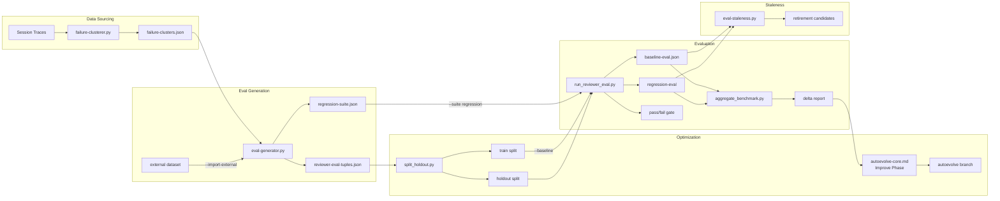

# AutoEvolve 改善ポリシー

> このファイルは karpathy/autoresearch の program.md に相当する概念的ガイドである。
> AutoEvolve エージェントが設定を改善する際の方針・制約・優先度を定義する。
> ユーザーがこのファイルを編集することで、改善の方向性を操作できる。

## システムパイプライン



## 改善の優先度

以下の順序で改善を優先する:

1. **精度向上** — プロジェクトごとの規約・パターンを正しく適用できるようにする
2. **エラー削減** — 繰り返し発生するエラーの根本原因を解消する
3. **コンテキスト効率** — 同じタスクにかかるトークン消費を削減する
4. **速度向上** — hook の実行時間、エージェントの応答時間を改善する

## 改善対象

### 優先的に改善して良いもの

- `references/error-fix-guides.md` — エラーパターン→修正マップの追加
- `references/situation-strategy-map.md` — 状況→戦略マップの追加（最大 50 エントリ）
- `references/tool-sequence-patterns.md` — ツールシーケンスパターンの追加（5 回以上出現のみ）
- `rules/common/*.md` — 品質ルールの追加・改善
- `references/golden-principles.md` — 自動検証パターンの追加
- `agents/*.md` — エージェント定義のプロンプト改善
- `skills/*/SKILL.md` — スキルの手順改善

### 慎重に扱うべきもの（差分を小さく）

- `scripts/{runtime,policy,lifecycle,learner}/*.py|*.js` — hook スクリプトの変更
- `settings.json` — hook 登録の追加・変更
- `CLAUDE.md` — コア原則の変更

### 変更禁止

- API キー・トークン・パスワードに関する設定
- `permissions` セクション（allow/deny リスト）
- `model` 設定の変更
- 他人のプロジェクト固有の設定

## 実験カテゴリ

| カテゴリ | 変更対象 | スコアリング基準 |
|---------|---------|----------------|
| errors | `references/error-fix-guides.md` | 同一エラーの再発回数 |
| quality | `references/golden-principles.md`, `rules/` | 同一ルール違反の頻度 |
| agents | `agents/*.md` | タスク完了までのターン数 |
| skills | `skills/*/SKILL.md` | skill-executions.jsonl の平均スコア (Failing→Healthy) |
| evaluators | hooks, golden-check patterns | Evaluator TPR/TNR + Rogan-Gladen corrected rate |
| comprehension | `rules/common/comprehension-debt.md`, review coverage | design_revision_rate, repeated_investigation_count |
| review-comments | `skills/review/SKILL.md`, `agents/code-reviewer.md` | review-feedback.jsonl の positive/negative 比率、指摘の accept/reject 率 |
| output-diff | `skills/*/SKILL.md`, `rules/` | 同種の人間編集が N 回蓄積 → ルール候補を自動生成 |

## 実行条件

- **最小セッション数**: 1（v1 では 3）
- **実行頻度**: 毎日（cron）またはオンデマンド（`/improve`）
- **並行実験**: 改善余地のある全カテゴリで同時実行

## Spot Checking（部分検証戦略）

> AutoAgent (2026-04): 小さな変更はフルスイートでなく部分テストで検証し、イテレーション速度を大幅に向上。

改善提案の検証時、変更の影響範囲に応じてテスト戦略を選択する:

| 変更影響 | 検証方法 | 例 |
|---------|---------|-----|
| 単一ファイル、局所的 | 関連する 1-2 セッションの trace で spot check | error-fix-guides.md に 1 パターン追加 |
| 複数ファイル、横断的 | 影響を受けるカテゴリのみ再評価 | agents/*.md のプロンプト修正 |
| コア原則、広範囲 | フル評価（全カテゴリ） | CLAUDE.md の core_principles 変更 |

## 制約

### 安全ルール

1. **1回の改善サイクルで変更は最大3ファイル** — 大きな変更は分割する
2. **必ずブランチで作業** — `autoevolve/YYYY-MM-DD-{topic}` ブランチを作成
3. **master への直接変更禁止** — 必ずユーザーレビューを経由
4. **既存テストを壊さない** — 変更後に `uv run pytest tests/` を実行して確認
5. **ロールバック可能な変更のみ** — 不可逆な変更は提案のみ
6. **スキル改善は実行データ5回以上** — データ不足での改善は行わない
7. **retire は段階的** — まず `[DEPRECATED]` 付与、次回 audit で改善なければ削除提案
8. **修正後の A/B delta が +2pp 未満なら merge しない** — SkillsBench 研究 (7,308 runs) でノイズマージンが ±2pp と判明。それ以下の改善は統計的に有意でない
9. **スキル修正後は必ずベースラインテスト** — 修正前にスキルなし性能を測定し、修正後も同テストを実行。delta を定量化してから merge 判断
10. **LLM 自動生成の修正は人間レビュー必須** — SkillsBench で LLM 自己生成スキルは平均 -1.3pp。`skills/*/SKILL.md` および `agents/*.md` の変更は自動マージ条件から除外。`gate_proposal()` が `auto_accept` を返しても、これらのファイル変更は `pending_review` に格下げ
11. **Brevity Bias 対策** — エージェント定義のドメイン知識セクション（Symptom-Cause-Fix テーブル、コードパターン、failure modes）は簡潔化の対象外。ACE 研究 [Zhang+ 2026] で反復最適化がプロンプトを汎用的に崩壊させる傾向が確認されている。行動指示（tools, permissions, format）のみ簡潔化対象
12. **Knowledge Embedding 比率維持** — エージェント定義の内容比率は「ドメイン知識 ≥ 50%、行動指示 ≤ 50%」を目安とする。`/improve` サイクルでこの比率を下回る変更は discard
13. **フィードバック履歴 H の注入制限** — Proposer への H 注入は直近 20 件 + 対象スキルフィルタに制限。60 日以上前のエントリはサマリー化**せず** FS 上に保持する。Proposer がタスク関連キーワードで `~/.claude/agent-memory/traces/` を grep し、関連エントリのみ読む（Meta-Harness: 要約注入は性能を下げる 50.0→34.9）。`build_proposer_context()` のデフォルト引数に従う
14. **rejected-patterns の /improve 注入** — `/improve` 実行時に `learnings/rejected-patterns.jsonl` を Phase 4 (Feedback Loop) の入力として注入する。直近 30 日の reject エントリのみ注入（古いものは自動アーカイブ）。同一 category の reject が 3件以上 → そのカテゴリの提案を suppress。承認率が 50% 未満の場合、Governance Level を 1段階引き上げ
15. **Proposer Anti-Patterns 遵守** — `autoevolve-core.md` の AP-1〜4 に従う。violation する提案は却下
16. **--evolve コスト上限** — デフォルト iterations=3、最大=5。1 イテレーション=1 スキル。2 イテレーション連続 auto_reject で早期終了。コスト上限: 30 LLM 呼び出し/実行
17. **--evolve は worktree 隔離必須** — イテレーティブループの Builder フェーズは worktree 上で実行。master ブランチへの直接変更禁止
18. **ドリフトガード: 連続 reject 上限** — `--evolve` ループで 3 イテレーション連続 `revert` が発生した場合、ループを即時停止しユーザーにエスカレーションする。autoresearch 記事: "12時間放置でエージェントが別の問題を解き始めた"。連続 reject = 目的から逸脱のシグナル
19. **ドリフトガード: 目的メトリクス後退検出** — `--evolve` ループの各イテレーションで、ベースラインスコアからの累積改善を追跡する。3 イテレーション経過後にベースラインを下回っている場合はループを停止し「戦略を再検討」を推奨する
20. **単一変更規律（デフォルト）** — `--evolve` ループの各イテレーションでは SKILL.md への変更を **1箇所のみ** に制限する。`--single-change` はオプションではなくデフォルト動作とする。仮説を明記し、changelog に記録する。revert された仮説は同一表現で再試行しない。autoresearch 記事: "proposal quality dominates total cost" — 少数の精度の高い変更が多数の探索的変更に勝る。meta-agent (Anthropic 2026): "one targeted change at a time, smallest effective fix" で holdout 67→87% を達成。複数変更が必要な場合は `--multi-change` で明示的にオプトインする
21. **Proxy Metric 乖離検出（Goodhart 警告）** — skill 改善時にスコアが +5pp 以上上昇した場合、自動で「Why did score increase?」の説明を要求する。以下を追加チェック: (1) テスト難易度が下がっていないか（テスト行数の減少）、(2) assertion 数が減っていないか、(3) スコープが狭まっていないか（対象ファイル数の減少）。Goodhart's Law: 指標が目標になると指標としての機能を失う。検出は `scripts/policy/gaming-detector.py` が実行
22. **Self-referential Evaluation Criteria Improvement 禁止** — AutoEvolve が自身の評価基準（`improve-policy.md`, `skill-benchmarks.jsonl`, `benchmark-dimensions.md`）を直接変更することを禁止する。評価基準の変更は必ず人間の承認を必要とする。スクリプト/プロンプトの自己改善は Rule 30 で制約付き許可。Bengio 論文: エージェントが自身の報酬関数を変更できる場合、reward tampering が最適戦略になり得る
23. **Metric Diversity 要件** — skill 改善の評価は単一メトリクスではなく最低2つの独立指標で判定する。例: 実行時間 + ユーザー満足度、テスト通過率 + コードレビュースコア。単一メトリクスへの過度な最適化は specification gaming の温床になる
24. **Self-Edit Justification (3-Question Gate)** — 改善提案時に以下の3質問に必ず回答する: (1) What problem does this solve?（具体的に。"might be better" は不可）、(2) How do we measure if it worked?（定量指標に紐づける）、(3) What if it breaks?（ロールバック計画、regression の blast radius）。いずれかが曖昧・欠落なら提案を draft に留める
25. **Knowledge Pyramid Tier 要件** — 学習データには `tier`（Raw/Exploratory/Benchmark/Doctrine）と `score`（0.0-1.0）を付与する。L3 (Rules) への昇格には Tier 2 (Benchmark) 以上、L4 (Golden Principles) には Tier 3 (Doctrine) を必須とする。詳細は `references/knowledge-pyramid.md` を参照
26. **Contradiction Mapping** — Garden フェーズで同一トピックに対する方向性の逆転（矛盾）を検出する。検出時は `boundary_condition` フィールドを付与して適用条件を明示するか、低品質側を降格する。自動解決は行わずユーザーに判断を委ねる。詳細は `references/contradiction-mapping.md` を参照
27. **Governance Levels** — カテゴリごとに自律性レベル（0:Observe / 1:Review / 2:Auto-Merge / 3:Trusted）を設定する。デフォルトは Level 1（現在の動作維持）。Level 2 以上への昇格は承認率・CQS に基づく。Level 3 は opt-in 必須。詳細は `references/governance-levels.md` を参照
28. **Stepwise Change Budget** — 1サイクル内の変更は段階的に保守的にする。1st change: epsilon=0.2（通常の変更幅）、2nd change: epsilon=0.15（やや保守的）、3rd change: epsilon=0.1（最も保守的）。根拠: HACRL Stepwise Clipping — 後半ほど保守的にしてドリフトを防止。`scripts/lib/rl_advantage.py` の `stepwise_clip_ratio()` で計算
29. **Acceleration Guard** — 直近3サイクルの accept_rate が前3サイクル比で +30pp 以上上昇した場合、警告を発行し人間レビューを要求する。Hyperagents 論文 (arXiv:2603.19461) の「加速的改善カーブ」は真の改善を示す場合もあるが、評価基準の緩み（Rule 21 Goodhart 警告に類似）やテスト難易度低下の可能性もある。`compute_cqs()` の verdict 分布と合わせて判断する
30. **Self-referential Script/Prompt Improvement (Hyperagents Pattern)** — AutoEvolve は自身のスクリプト・エージェント定義も改善対象に含めることができる。ただし以下の制約に従う: 対象: `scripts/learner/*.py`, `agents/meta-analyzer.md`, `agents/autoevolve-core.md`。除外: `experiment_tracker.py`, `lib/*.py`（データ整合性保護）。制約: (1) 必ず worktree で隔離して実行、(2) A/B テスト必須、(3) 通常改善サイクル 5 回に 1 回まで。根拠: Hyperagents (arXiv:2603.19461) のメタ認知的自己修正パターン
31. **Archive-Based Exploration (Hyperagents Pattern)** — `compute_improvement_trend()` のトレンドが `saturating` の場合、線形改善から分岐探索に切り替える。`archive_snapshot()` で高パフォーマンスバリアントを保存し、`select_parent_variant()` で分岐元を確率的に選択する。分岐探索で改善が見つかったら最良バリアントにマージ。デフォルトは線形改善（最新版を改善）。根拠: Hyperagents (arXiv:2603.19461) のアーカイブベースオープンエンド探索
32. **Cross-Model 検証 (Meta-Harness Transfer)** — スキル改善の A/B delta が +3pp 以上の場合、異なるモデル（Haiku or Codex）での smoke test を推奨する。cross-model delta が -5pp 以上低下する変更は model-specific 過学習の疑いがあり、revert を検討する。根拠: Meta-Harness (Lee+ 2026) の単一ハーネスが5モデルに転移して +4.7pt
33. **Contrastive Trace Analysis (Glean Trace Learning)** — `/improve` の Step 0 前に `contrastive-trace-analyzer.py` を自動実行する。結果は `situation-strategy-map.md` への追加候補としてユーザーに提示する。候補の自動マージは行わない
34. **Situation-Strategy Map 更新ポリシー** — `/improve` が候補を提案し、人間が承認して追記する。最大 50 エントリ。古いエントリは `/improve` の Garden フェーズで prune を提案する
35. **Tool Sequence Patterns 記録閾値** — `tool-sequence-patterns.md` には 5 回以上出現したパターンのみ記録する。`/analyze-tacit-knowledge` の Stage 3 で抽出し、Stage 5 で更新候補として提案する
36. **合意検証の閾値 (Multi-trace Consensus)** — 同一 `task_type` のトレースが 3 件以上あり、かつ戦略が一致する場合のみ学習する。2 件以下は skip（Glean: 不一致解消不能時は学習しない）
37. **Diff-Distill-Writeback (Output Diff Loop)** — AI 出力と人間の最終編集の diff を蓄積し、同種の編集が 10 回以上蓄積した場合にルール候補を自動生成してスキルファイルに書き戻す。手順: (1) session-trace-store が出力と最終版の diff を記録、(2) `/improve` の Analyze フェーズで diff を分類・集約、(3) 同一分類が 10+ 件で Proposer がルール候補を生成、(4) 人間レビュー後にスキルの ban list / preference / convention に追記。出典: "Skill Loop Wiring" 記事 — 6ヶ月運用で v1.0→v1.3 の自律進化を達成

40. **Anti-overfit Prompt Technique (meta-agent Pattern)** — Proposer が改善提案を生成する際、以下の指示を必ず含める: 「提案をエージェントの行動ルールとして述べよ。特定のトレースを指さないと正当化できないなら、そのルールは狭すぎる。」 具体的セッションの修正ではなく、一般化された行動規範として提案すること。根拠: meta-agent (Anthropic 2026) — 初期イテレーションで特定トレースへの過学習が頻発し search accuracy は上がるが holdout が下がった。この指示追加で汎化性能が改善
41. **Skill 化優先ヒューリスティック (meta-agent Pattern)** — Proposer が改善提案を生成する際、「システムプロンプト修正」と「skill 作成/修正」の2択がある場合、skill 化を優先する。判断基準: (1) ドメイン固有のビジネスルール → skill に分離、(2) ツール使用の一般指示 → システムプロンプト、(3) 両方に該当 → skill に分離してシステムプロンプトからは参照のみ。根拠: meta-agent (Anthropic 2026) — ビジネスルールを skill に移動した変更が最大の holdout 改善（→80%）を達成。プロンプトへのルール埋め込みはオーバーヘッドが大きく性能を下げた
42. **Per-trace Critique 方向性 (meta-agent Pattern)** — 将来的に session-learner が各トレースに自然言語批評（「なぜ失敗したか」の1-2文）を付与する仕組みを導入する。現時点では手動の `/improve` 分析で代替するが、Proposer への入力として binary success/failure より自然言語批評の方が豊かな最適化シグナルを提供する。根拠: meta-agent (Anthropic 2026) — judge-based search (87%) が labeled-search (80%) を上回った
43. **Holdout Validation Gate 方向性 (meta-agent Pattern)** — `--evolve` ループで holdout セット概念を導入する方向で検討する。各イテレーションの変更は search セット（改善対象）で評価し、最終的な accept/reject は holdout セット（未見データ）で判定する。search/holdout 比率は 70/30 を目安とする。現時点では skill-audit の A/B ベンチマークで代替するが、将来的に自動化する。根拠: meta-agent (Anthropic 2026) — holdout validation なしでは search accuracy は上がるが汎化しない

44. **タスクカテゴリ別ルーブリック評価 (DR Self-Optimization Pattern)** — `/improve` の Phase 2 (Analyze) で、汎用スコアではなくタスクカテゴリ別の評価基準を生成する。手順: (1) `skill-executions.jsonl` のエントリを `task_type` でグルーピング、(2) カテゴリごとに「良い出力の基準」を 3-5 項目で定義（例: code-review なら「指摘の具体性」「false positive 率」「修正提案の実行可能性」）、(3) 各トレースをカテゴリ別基準で再評価し、カテゴリ間の品質差異を検出。汎用オプティマイザがタスク固有信号を欠くと改善が停滞する（Câmara+ 2026: OpenAI optimizer 0.583 vs GEPA 0.705）。ルーブリックは `/improve` 実行ごとに再生成し、永続化しない（タスク分布の変化に追従するため）

38. **CLI-over-Logs 原則 (Meta-Harness Navigable Logs)** — `/improve` の Analyze フェーズでトレース履歴を探索する際、生ログを逐次読むのではなく、構造化クエリで必要な情報にアクセスする。session-trace-store が提供すべきクエリ: (1) Pareto frontier 一覧（精度 vs コスト）、(2) top-k 候補の一覧、(3) 候補間の diff。ログは JSON 等の machine-readable 形式で階層的に構造化する。根拠: Meta-Harness (Lee+ 2026) 実装 Tips — "Build a small CLI over the logs" + "Log everything in a navigable format"
39. **評価の Proposer 外部化 (Critic-Refiner 分離強化)** — `/improve` の評価（スコアリング）は Proposer（改善提案者）の外で自動実行する。Proposer が自分の提案を自分で評価すると、確証バイアスで過大評価する。具体的には: (1) `--evolve` ループの A/B テスト実行は Proposer コンテキストの外で行う、(2) スコアリングスクリプトは Proposer が変更不可（Rule 22 の延長）、(3) 結果は FS に書き込み、Proposer は読み取りのみ。根拠: Meta-Harness (Lee+ 2026) — "Automate evaluation outside the proposer" + AutoHarness Critic-Refiner 分離原則

### Dreaming 4フェーズ対応（/improve → CC Dreaming 補完）

CC の Dreaming (Layer 6) は4フェーズでクロスセッション統合を行う。
`/improve` はこの4フェーズに対応し、Dreaming が到達しない深い改善を担う。

| CC Dreaming フェーズ | /improve の対応 | 補完内容 |
|---------------------|---------------|---------|
| **Orient** — memory/ の現状把握 | Step 0: ダッシュボード | CQS・インフラメトリクス・session metrics を追加表示 |
| **Gather Signal** — トレース検索 | Step 1: Analyze (Critic) | contrastive-trace-analyzer + error 集約 |
| **Consolidate** — メモリ更新 | Step 2-3: Propose + Implement (Refiner) | rules/agents/skills の構造的改善 |
| **Prune/Index** — MEMORY.md 整理 | Step 4: Garden | verification sweep + 容量管理 + 陳腐化検出 |

### ナロースキャン原則

> 出典: CC Dreaming の設計指針 "Don't exhaustively read transcripts. Look only for things you already suspect matter."

`/improve` の Analyze フェーズでは:
- トレース全体を読まない。仮説を立ててからキーワード grep する
- `session-trace-store.py` の検索は `grep -rn "<narrow term>" --include="*.jsonl" | tail -50` 相当に絞る
- 仮説のない網羅的スキャンはコストに見合わない。既存の FM 分類と learnings から仮説を導出する

### メモリ品質ゲート（ノイズ判定基準）

Garden フェーズで既存メモリ・learnings を棚卸しする際、以下の3層で保存価値を判定する。
テスト: 「人間が次のセッションでこれを知っていたら役立つか？」

| Tier | 分類 | 保存判定 | 例 |
|------|------|---------|-----|
| 1 | Operational (LOW) | 診断用のみ。cognitive memory に昇格しない | tool sequence, timing metrics, success rates, file modification logs |
| 2 | Behavioral (MEDIUM) | 選択的に保存 | ユーザー好み, ワークフローパターン, コミュニケーションスタイル |
| 3 | Cognitive (HIGH) | 常に保存・昇格 | ドメイン洞察, 根拠付き設計決定, 失敗からの教訓, 知識の境界条件 |

- Tier 1 が L1 以上に昇格していたら降格する
- Tier 2 は 2+ セッションで確認されたものだけ L2 以上に昇格
- Tier 3 は `lessons-learned.md` への 1行追記も検討する

### Critic-Refiner 分離原則

AutoEvolve の Analyze → Propose フェーズでは、エラー集約（Critic）と改善提案（Refiner）を明示的に分離する。
根拠: AutoHarness (Lou+ 2026, arXiv:2603.03329) で Critic の品質が Refiner の出力品質に直結することを示唆。

- **Critic フェーズ**: 何が問題か。エラーを分類・集約し、パターンを特定する。改善案は出さない
- **Refiner フェーズ**: どう直すか。Critic の集約結果を入力として改善コードを提案する
- Critic が不十分なまま Refiner に進むと "garbage in, garbage out" になる。Critic の出力を検証してから Refiner に渡す

### 品質基準

- 変更はシンプルで、意図が明確であること
- 変更理由が learnings データに裏付けられていること（「なんとなく」は NG）
- 既存の設計パターンに従うこと（新しいパターンを導入しない）

## 評価指標（定量）

各カテゴリに定量メトリクスと判定閾値を定義する。
autoresearch の「val_bpb が下がった → keep」に倣い、二値判定を基本とする。

| カテゴリ | メトリクス | keep 条件 | discard 条件 |
|---------|----------|----------|-------------|
| errors | 同一エラーの再発回数（直近 5 セッション） | 20%以上減少 | 増加 or 変化なし |
| quality | 同一ルール違反の頻度（直近 5 セッション） | 20%以上減少 | 増加 or 変化なし |
| agents | タスク完了までの平均ターン数 | 15%以上減少 | 増加 |
| skills | skill-executions 平均スコア + A/B delta | 20%以上のスコア向上 AND A/B delta > +2pp | スコア低下 or A/B delta < -2pp |
| evaluators | Evaluator TPR/TNR（review-feedback）+ Rogan-Gladen 補正 | TPR/TNR 両方 5%以上向上 | いずれか低下 |
| comprehension | design_revision_rate（レビュー指摘で設計変更が必要になった割合） | 20%以上減少 | 増加 or 変化なし |
| comprehension | repeated_investigation_count（同一コード領域の複数セッション調査） | 減少 | 増加 |
| comprehension | spec_slop_detection_rate（Spec Slop 検出頻度） | 減少 | 増加 |

- `experiment_tracker.py measure <exp-id>` で自動計測する
- 判定は `measure_effect()` の ±20% 閾値に準拠
- データ不足（before_count=0）の場合は `insufficient_data` とし、次サイクルまで待機

## 複雑さ予算（Simplicity Criterion）

autoresearch の原則: 「0.001 の改善 + 20 行の追加 → 不採用」「コードを消して同等 → 必ず keep」

- 改善効果が小さい（<10% 改善）のに複雑さが増す変更 → discard
- コード・設定を削除して同等以上の効果 → 必ず keep
- 設定行数は「全体で増やさない」を原則とする
- 1 つの改善に 20 行以上の追加が必要なら、設計を再考する
- 既存のパターンを流用できる場合、新しいパターンを導入しない

## 自動マージ条件（低リスクカテゴリのみ）

以下の **全て** を満たす場合、autoevolve ブランチを自動マージ可能:

1. 変更対象が `references/error-fix-guides.md` のみ（追記のみ、`skills/*/SKILL.md` は対象外）
2. テストが全て pass
3. 定量メトリクスが keep 条件を満たす
4. 変更行数が 10 行以下
5. 既存パターンのフォーマットに従っている

上記以外は引き続き人間レビュー必須。

## 実験履歴の可視化

`experiment_tracker.py export-tsv` で全実験の俯瞰ビューを出力する。
autoresearch の results.tsv に倣い、1 行 1 実験のフラットな TSV 形式。

## インフラメトリクス

Knowledge-to-Code Ratio やメンテナンスコストなど、インフラ全体の健全性を追跡する指標。
Codified Context 論文のベンチマーク（24.2%、~1-2時間/週）を参考値として使用。

| メトリクス | 計測方法 | 参考値 |
|----------|---------|--------|
| Knowledge-to-Code Ratio | `(agents + references + rules 行数) / プロジェクトコード行数` | 24.2% |
| Agent ドメイン知識比率 | `ドメイン知識行数 / エージェント総行数` | ≥ 50% |
| Spec Staleness | `/check-health` の陳腐化警告数 | 0 |
| Maintenance Cost | セッション中の spec 更新時間 | ~5分/セッション |

これらは `/improve` サイクルのダッシュボードに含め、傾向を追跡する。
Agent の挙動が不安定なときは spec の欠落・陳腐化のシグナルとして扱う。

## 累積品質スコア (CQS)

改善サイクル全体の効果を定量追跡する複合スコア。
`experiment_tracker.py compute-cqs` または `status` で確認可能。

| verdict | スコア |
|---------|--------|
| keep | +10 * abs(change_pct) / 100 |
| discard | -15 |
| neutral | -2 |

- merged 実験 5 件未満では `insufficient_data`（信頼性不足）
- CQS が負の場合、改善戦略の見直しを推奨
- `/improve` のダッシュボードに CQS を含める
- ベンチマーク次元の詳細は `references/benchmark-dimensions.md` を参照

## ロールバック改善ゲート

merged 実験が後続の品質悪化を引き起こした場合に検出する仕組み。
`experiment_tracker.py check-regression <exp-id>` で実行。

| 条件 | アクション |
|------|-----------|
| merged 後 learnings イベント数 +20% (measure_effect verdict=discard) | ロールバック提案を出力 |
| 同カテゴリ discard 2件以上 | ロールバック提案を出力 |

- 提案は `[ROLLBACK SUGGESTED] exp-id: reason` 形式で出力
- 自動実行はしない。`/improve` ダッシュボードに表示し、ユーザーが判断
- merged 後 3 セッション未満は安定化待ちとして判定をスキップ
- Phase 3 Garden の Quality Gate が全 merged 実験に対して実行

## 知識蒸留パイプライン

学習データを段階的に抽象化・昇格する5レベルのパイプライン。

| Level | 名前 | 保存先 | 例 |
|-------|------|--------|-----|
| L0 | Raw events | `learnings/*.jsonl` | エラーイベント、品質違反 |
| L0.5 | Review findings | `learnings/review-findings.jsonl` | レビュー発見事項（R-11 入力） |
| L1 | Recovery tips | `learnings/recovery-tips.jsonl` | error→recovery ペア |
| L2 | Error fix guides | `references/error-fix-guides.md` | パターン化された修正手順 |
| L3 | Rules | `rules/common/*.md` | 自動検証ルール |
| L4 | Golden principles | `references/golden-principles.md` | プロジェクト横断の原則 |

### 追加入力ソース（Phase 3 TVA）

| スクリプト | 入力 | 出力 | 実行タイミング |
|-----------|------|------|--------------|
| `findings-to-autoevolve.py` (R-11) | `review-findings.jsonl` | `recovery-tips.jsonl` への L1 昇格 | `/improve` 実行時 |
| `qa-tuning-analyzer.py` (R-12) | `review-findings.jsonl` + telemetry | reviewer 改善提案 advisory | `/improve` 実行時 |
| `staleness-detector.py` (R-13) | `logs/hook-telemetry.jsonl` | 陳腐化レポート advisory | `/improve` 実行時 |

### 昇格条件

| 遷移 | 条件 |
|------|------|
| L0 → L1 | 同一 error_pattern が 2 回以上 + recovery_action が有効 |
| L1 → L2 | 同一パターンが 3 回以上 + recovery 成功率 > 50% |
| L2 → L3 | 5 回以上の再発 + 自動検出可能なパターン |
| L3 → L4 | 複数プロジェクトで有効 + 例外なく適用可能 |

- 逆方向の降格も許容: ルール違反が増加した場合は L3 → L2 に差し戻す
- 各レベルの件数は Garden フェーズでモニタリングする

## Tournament Mode

CQS が停滞（0.0-2.0）し通常の improve が neutral を返す場合、
複数戦略を並列比較する tournament mode を使用できる。
手順は `skills/improve/instructions/tournament-mode.md` を参照。

| ルール | 内容 |
|--------|------|
| 最大バリアント数 | 3 |
| バリアントあたり最大ターン | 10 |
| 1サイクルあたり最大回数 | 1 |
| 勝者判定 | review-dimensions.md の加重平均スコア最高 |
| タイブレーク | 差 < 0.5 なら Conservative 優先（KISS） |
| テスト失敗 | 自動除外 |

## RL-Inspired 評価指標

Policy Gradient の手法を離散最適化に適応した指標群。
`scripts/lib/rl_advantage.py` に実装。

### RLOO / GRPO Advantage

K variant（K>=3）のスキル設定を並行評価し、
各 variant の相対的な優劣を定量化する。

- **RLOO**: Leave-One-Out baseline。
  自身を除く平均との差分。ノイズに強い
- **GRPO**: グループ z-score 正規化。
  variant 間の相対位置を標準化

`aggregate_benchmark.py --variants v1.json v2.json v3.json`
で RLOO/GRPO advantage を含むレポートを生成。

### Importance Sampling (IS)

設定バージョンが変わった過去データの重みを割り引く。
`config_version`（SHA-256 先頭12文字）で追跡し、
`importance_weight()` で指数減衰の重みを計算。

- 同一 config_version → weight=1.0（完全に有効）
- 異なる version → `exp(-decay_rate * change_count)`

### Clipping

PPO スタイルの変更比率クリッピング。
`clip_ratio(after, before, epsilon=0.2)` で
スコア変動を ±20% に制限。

`skill_amender.gate_proposal()` で自動適用。
クリップ発動時は reason に `[CLIP WARNING]` を追記。

### Stepwise Clipping

HACRL の Stepwise Clipping に着想。1サイクル内で複数変更を重ねる場合、
更新回数に応じて許容変更幅を段階的に狭める。

`stepwise_clip_ratio(after, before, step)` で計算。
step=0 は通常の clipping、step が進むごとに epsilon が step_decay 分だけ減少（下限 0.05）。

`skill_amender.gate_proposal()` で step 番号を渡して自動適用。

### Per-step Credit Assignment

セッション outcome をスキル呼び出し回数に比例配分。
`step_credit()` で計算、`skill-credit.jsonl` に記録。

outcome スコア: clean_success=1.0, recovery=0.6, failure=0.2

## 仮定ストレステスト（Assumption Stress-test）

> 出典: Anthropic "Harness Design for Long-Running Apps" (2026-03)
> "every component in a harness encodes an assumption about what the model can't do on its own, and those assumptions are worth stress testing."

ハーネスの各コンポーネントは「モデルが単独ではできないこと」を仮定している。
モデル改善に伴い、その仮定が陳腐化する可能性がある。

### 実行タイミング

- `/improve` の Garden フェーズで**四半期に1回**実施
- 新しいモデルリリース後（Opus/Sonnet のメジャーアップデート時）

### 方法論

1. **コンポーネント一覧の作成**: `agent-harness-contract.md` の Hook 閾値サマリから対象を列挙
2. **仮定の明文化**: 各コンポーネントが前提とする「モデルの能力限界」を1文で記述
3. **除去テスト**: 1コンポーネントを無効化し、同一タスクを実行。品質・速度・コストの変化を計測
4. **判定**:
   - 品質低下なし → コンポーネントは **scaffolding**（除去候補）
   - 品質低下あり → コンポーネントは **load-bearing**（維持）
   - 品質向上 → コンポーネントが**悪影響**（即時除去）
5. **記録**: 結果を `insights/assumption-stress-test.md` に記録

### 制約

- 1回のテストで除去するのは **1コンポーネントのみ**（交互作用を排除）
- テスト環境は worktree で隔離
- 除去候補でも即削除せず、`[DEPRECATED]` 付与 → 次回テストで再確認 → 削除提案

## Verification Sweep（Garden フェーズ拡張）

`/improve` の Garden フェーズで `lessons-learned.md` の verify: 行を機械実行する。
"ルールは wish。verify: 付きルールが guardrail。guardrail だけが生き残る。"

### 実行手順

1. `lessons-learned.md` を読み、`verify:` 行を持つエントリを列挙
2. 各 verify: を実行（Grep, Glob, Read, git diff 等）
3. 結果を判定:
   - **PASS**: 無言で次へ
   - **FAIL**: 違反をレポートに含め、修正提案を出力
   - **manual**: スキップ（将来の具体化候補としてカウント）
4. サマリー出力: `verify: X checked, Y passed, Z failed, W manual`

### verify: 行のフォーマット

```
verify: Grep("pattern", path="scope") → N matches     # grep 検証
verify: Glob("pattern") → N+ matches                   # ファイル存在検証
verify: git diff に X が含まれない                       # diff 検証
verify: manual（理由）                                   # 機械検証不可
```

- verify: manual は技術的負債。Garden で「具体化できないか」を毎回検討する
- 新規 lessons-learned エントリは verify: 行を必須とする

## Session Metrics（セッション効果の定量化）

セッション単位でメトリクスを追跡し、AutoEvolve の effectiveness を可視化する。
記事 "Self-Evolving System" の session scoring を AutoEvolve フレームワークに適応。

### 追跡メトリクス

| メトリクス | 収集方法 | 用途 |
|-----------|---------|------|
| corrections_received | feedback memory の新規作成数 | 学習シグナルの量 |
| verify_checked | Garden sweep の実行数 | 検証カバレッジ |
| verify_passed | Garden sweep の PASS 数 | ルール遵守率 |
| verify_failed | Garden sweep の FAIL 数 | 違反検出 |
| verify_manual | Garden sweep の manual 数 | 技術的負債量 |
| lessons_added | lessons-learned.md の差分行数 | 知識蓄積速度 |

### トレンド検出（5+ サイクル蓄積後）

- corrections 減少傾向 → システムが機能している
- corrections 横ばい/増加 → ルールが曖昧 or 参照されていない。ルール具体化を優先
- verify_failed が同一ルールで再発 → rules/ への昇格候補（L3 への promotion）
- verify_manual 比率 > 50% → 具体化スプリントを推奨

### `/improve` ダッシュボードへの組み込み

既存の CQS・インフラメトリクスと並べて session metrics を表示する。

## Promotion Ladder（知識の段階的昇格）

知識蒸留パイプライン (L0→L4) を補完する correction-driven な昇格メカニズム。
記事の "correction 2回→auto-promote" パターンを AutoEvolve の安全ルールに準拠させて適応。

### 昇格条件

| シグナル | 行き先 | 条件 |
|---------|--------|------|
| feedback memory 1回目 | 記録のみ | — |
| 同一パターン 2回目 | `lessons-learned.md` に追記（verify: 行必須） | Garden フェーズで自動検出・提案 |
| lessons-learned で verify: PASS 10+ サイクル連続 | `rules/common/*.md` or `CLAUDE.md` への昇格候補 | `/improve` で提案、人間承認必須 |
| `/improve` で reject | 再提案禁止（improve-policy の既存ルール準拠） | evolution-log 相当の記録 |

### 降格条件

- verify: FAIL が 3+ サイクル連続 → ルールが陳腐化。削除 or 書き直しを提案
- 対象コードが削除された → ルール自体を削除提案

### 容量管理

- lessons-learned.md は **50エントリ上限**（記事の設計に準拠）
- 上限接近時: verify: PASS 10+ 連続のエントリを昇格候補として優先提示
- verify: manual のエントリを具体化 or 削除候補として提示

## Codex 品質保証ルール (v2)

> /improve v2 で追加。Codex (gpt-5.4) を分析と敵対的レビューの両方で必須使用し、
> 提案品質を「他の AI に突っ込まれない」レベルに保証する。

40. **Codex Deep Analysis 必須** — Phase 2 の Coverage Matrix 結果は必ず Codex で検証する。Codex が `SHALLOW` と判定したカテゴリは、提案生成 (Phase 3) 前に追加分析を行う。Codex 実行に失敗した場合はユーザーに報告して中断する（Codex なしでの提案生成は禁止）

41. **Adversarial Gate 必須** — 全提案は Phase 4 で Codex の敵対的レビューを通過する。5 観点（原則違反, 考慮漏れ, 証拠の弱さ, Pre-mortem の甘さ, 代替案の欠如）で攻撃。`FATAL_FLAW` 判定の提案はレポートに「却下」として記載するが推奨しない。`VULNERABLE` 判定は最大 1 回の精錬を経て再レビュー

42. **Coverage Matrix 完全性** — 全カテゴリの全必須問いに `ANSWERED` / `INSUFFICIENT_DATA` / `NOT_APPLICABLE` で回答する（`references/coverage-matrix.md` 参照）。未回答の問いがある状態で Phase 3 に進むことを禁止。「問題なし」と「データ不足」の混同は品質の根幹を損なう

43. **Principle Traceability 必須** — 全提案に `serves_principles`, `tension_with`, `pre_mortem`, `blast_radius`, `evidence_chain`, `rollback_plan` を含める。いずれかが欠落した提案は Phase 4 (Adversarial Gate) に進めない。形式的な記入（「特になし」等）は Codex が検出して `VULNERABLE` と判定する

44. **Propose-Adversarial ループ制約** — 最大 2 イテレーション（初回 + 精錬 1 回）。`FATAL_FLAW` は再提案しない。精錬で新規提案は追加しない。2 回後も `VULNERABLE` なら注意付きでレポートに含める。Codex の `missing_proposals` は「次回への申し送り」に記載（今回のスコープでは追加しない）
45. **Proposal Pool 管理** — `~/.claude/agent-memory/proposal-pool.jsonl` に成功提案を蓄積する。追加条件: `proposals.jsonl` の outcome が `merged` かつ outcome_delta > 0。上限: 50 エントリ。超過時は最も古いエントリを削除（LRU eviction）。Phase 2.0 Ideation-Debate で最大3件をカテゴリ関連度でサンプリングして注入。Pool エントリのスキーマ: proposals.jsonl と同一（outcome, outcome_delta が確定済み）。更新タイミング: Phase 3 (Garden) の末尾で、直近ランの merged 提案を自動追加

## 現在のフォーカス

全カテゴリを高頻度で改善する（2026-03-10 設定）

## Convergence Detection

/improve サイクルの改善幅が収束した場合の自動停止提案（AlphaLab Convergence-Aware Budgeting）。

| 設定 | 値 | 説明 |
|------|---|------|
| window | 5 | 直近N回の /improve サイクル |
| threshold | 0.30 | 採用率がこれ以下でプラトー警告 |
| min_data_points | 5 | データ不足時はスキップ |
| storage | `~/.claude/agent-memory/metrics/improve-history.jsonl` | 採用率の時系列ログ |

### プラトー時の推奨アクション

1. `/improve --deep` — Teacher-Student 比較で深掘り分析
2. `/audit` — コードベース全体の品質監査で新しい改善軸を発見
3. `/refactor-session` — 技術的負債の清掃にフォーカス切替
4. Tournament Mode — 複数戦略の並列比較（`improve-policy.md` 参照）
