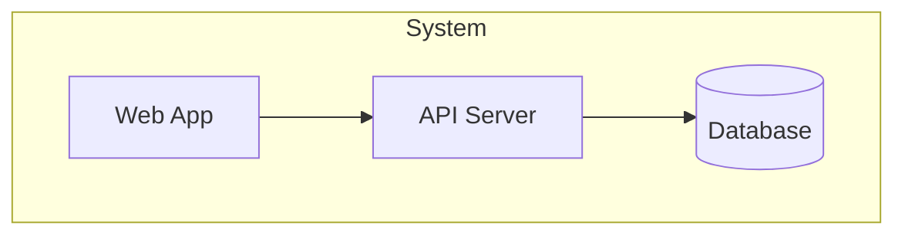

# Architecture Proposal: {system_name}

## Context

{problem_statement_and_current_state}

## Decision

{chosen_approach}

## C4 Model

### Context Diagram
```mermaid
graph TB
    User[User] --> System[{system_name}]
    System --> ExtA[External System A]
```

### Container Diagram


## Trade-offs

| Factor | This Approach | Alternative |
|--------|-------------|------------|
| {factor} | {pro/con} | {pro/con} |

## Risks

| Risk | Probability | Impact | Mitigation |
|------|------------|--------|-----------|
| {risk} | {H/M/L} | {H/M/L} | {mitigation} |
